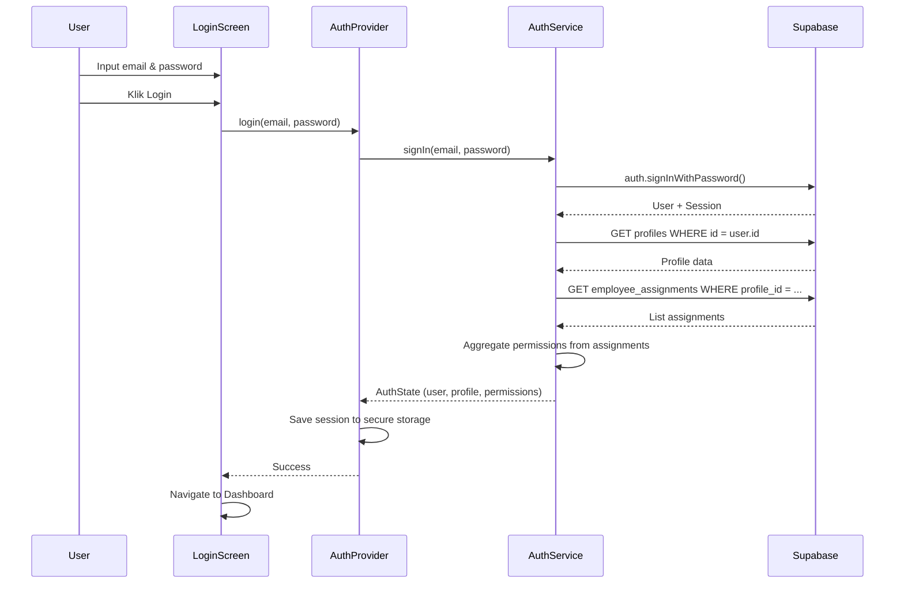
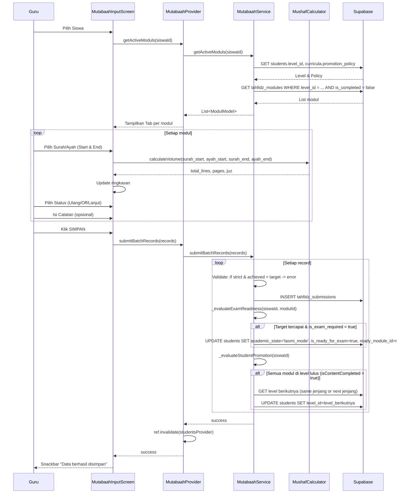
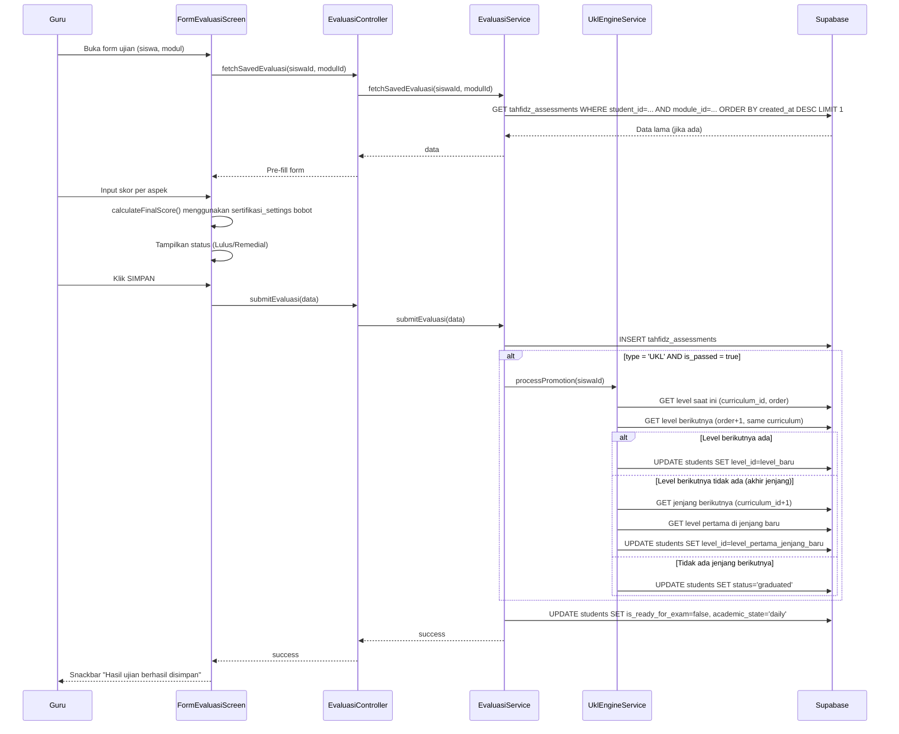
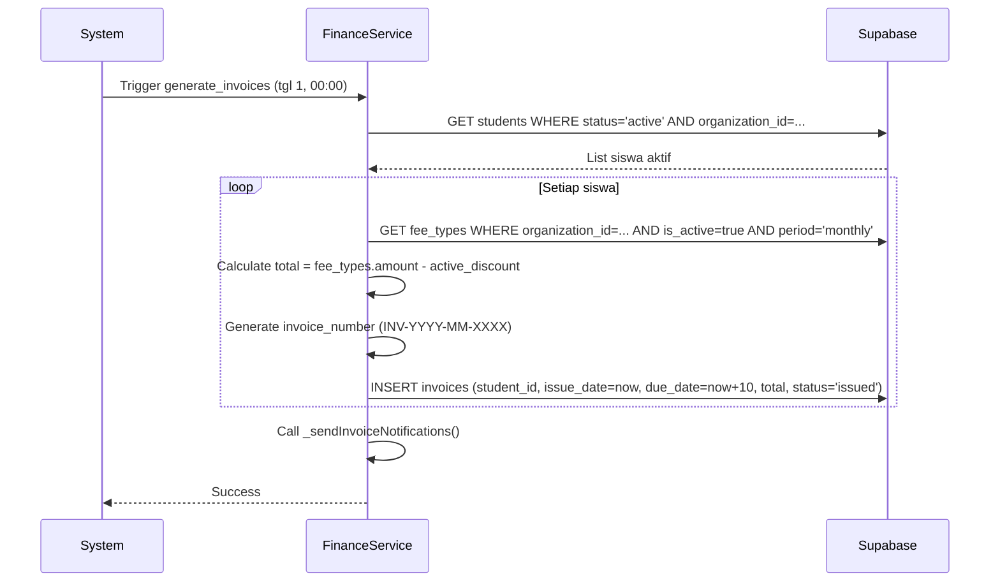
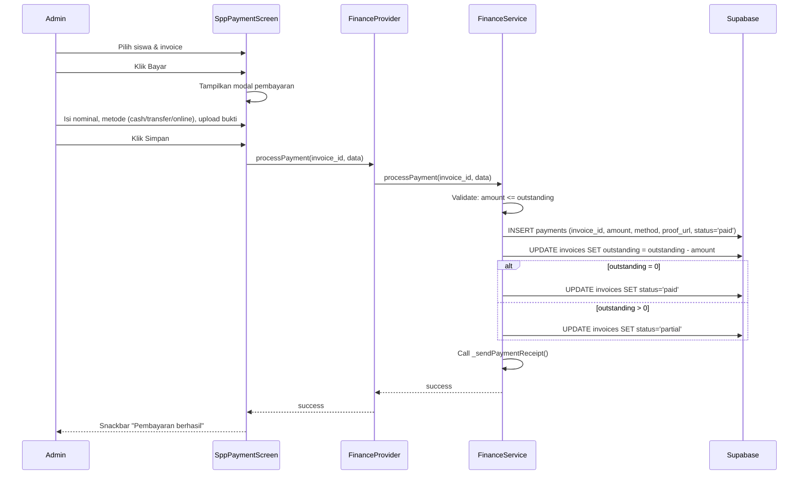

# SPACE EDUOS 

## MASTER SOFTWARE DESIGN DOCUMENT

### Education Operating System — Integrated Academic, LMS, Tahfidz, Operations & Intelligence Platform

---

**Document Type:** Master Software Design Document (SDD)  
**Product Name:** SPACE EDUOS  
**Product Category:** Education Operating System / Education Management Platform / LMS  
**Architecture:** Multi-Tenant, Modular Monolith, Feature-First  
**Primary Backend:** Supabase  
**Database:** PostgreSQL  
**Frontend:** Flutter  
**State Management:** Riverpod  
**Primary Language:** Dart  
**Deployment Target:** Web / PWA / Android / iOS  
**Document Status:** Master Specification (Complete)  
**Version:** 1.0  
**Date:** 28 Juli 2026  
**Purpose:** Single Source of Truth for Development  

---

# DAFTAR ISI

1. [Pendahuluan & Produk](#bab-1-pendahuluan--produk)
2. [Arsitektur Aplikasi](#bab-2-arsitektur-aplikasi)
3. [Use Case Diagram & Deskripsi](#bab-3-use-case-diagram--deskripsi)
4. [Functional Requirements (FR)](#bab-4-functional-requirements-fr)
5. [Non-Functional Requirements (NFR)](#bab-5-non-functional-requirements-nfr)
6. [Business Rules (BR)](#bab-6-business-rules-br)
7. [Data Dictionary & Database Schema](#bab-7-data-dictionary--database-schema)
8. [Sequence Diagrams](#bab-8-sequence-diagrams)
9. [UI Specification](#bab-9-ui-specification)
10. [API Specification](#bab-10-api-specification)
11. [Security & Row Level Security (RLS)](#bab-11-security--row-level-security-rls)
12. [Migration & Refactoring Guide (Dari Tahfidz Core ke SPACE EDUOS)](#bab-12-migration--refactoring-guide-dari-tahfidz-core-ke-space-eduos)
13. [Roadmap & Sprint Plan](#bab-13-roadmap--sprint-plan)
14. [Glossary & Appendices](#bab-14-glossary--appendices)

---
# BAB 1. PENDAHULUAN & PRODUK

## 1.1 Tujuan Dokumen

Dokumen ini adalah **Master Software Design Document (SDD) resmi SPACE EDUOS**. Dokumen ini menjadi **single source of truth** untuk:

- Product Owner
- UI/UX Designer
- Frontend Developer (Flutter)
- Backend/Database Developer (Supabase)
- AI Coding Agent
- QA
- DevOps
- Administrator
- Future Developer

Tujuan dokumen adalah membuat seseorang yang belum pernah mengikuti diskusi sebelumnya dapat memahami:

1. Apa itu SPACE EDUOS
2. Masalah apa yang diselesaikan
3. Siapa pengguna sistem
4. Bagaimana struktur organisasi pendidikan
5. Bagaimana setiap modul bekerja
6. Bagaimana data berhubungan
7. Bagaimana database Supabase dirancang
8. Bagaimana business logic diterapkan
9. Bagaimana permission bekerja
10. Bagaimana transaksi diproses
11. Bagaimana UI harus berperilaku
12. Bagaimana frontend berkomunikasi dengan backend
13. Bagaimana offline/sync bekerja
14. Bagaimana AI diintegrasikan
15. Bagaimana sistem diuji
16. Bagaimana sistem di-deploy
17. Bagaimana fitur baru harus dikembangkan tanpa merusak arsitektur
18. **Bagaimana mata rantai fitur eksisting Tahfidz Core dipetakan, direfactor, dan dikembangkan secara bertahap menjadi SPACE EDUOS.**

---

## 1.2 Product Identity

### 1.2.1 Nama
**SPACE EDUOS**

### 1.2.2 Positioning
SPACE EDUOS adalah:

> **Education Operating System yang menyediakan satu ruang digital terintegrasi untuk mengelola seluruh aktivitas lembaga pendidikan.**

SPACE EDUOS bukan sekadar:
- LMS
- Aplikasi absensi
- Aplikasi akademik
- Aplikasi tahfidz
- Aplikasi pembayaran
- Aplikasi rapor

SPACE EDUOS menggabungkan semuanya dalam satu ecosystem.

### 1.2.3 Tagline
Tagline kerja:
> **One Space. One Education Ecosystem.**

Alternatif positioning descriptor:
> **The Operating Space for Education.**

---

## 1.3 Product Vision

Membangun satu platform digital yang menyatukan:

```text
ORGANIZATION
      ↓
ACADEMIC
      ↓
LEARNING
      ↓
ASSESSMENT
      ↓
ATTENDANCE
      ↓
OPERATIONS
      ↓
COMMUNICATION
      ↓
ANALYTICS
      ↓
AI
```

---

## 1.4 Product Principles

### 1.4.1 Single Source of Truth
Data utama hanya boleh memiliki satu sumber kebenaran. Data siswa (`student`) tidak boleh dibuat ulang secara terpisah per modul.

### 1.4.2 Modular
Setiap domain terisolasi secara logis (`academic`, `lms`, `tahfidz`, `attendance`, `finance`, `hr`, `communication`, `ai`).

### 1.4.3 Multi-Tenant by Design
Setiap data tenant memiliki `tenant_id` / `organization_id` dan dikontrol menggunakan Supabase RLS.

### 1.4.4 Security by Default
Akses database **DENY** secara default, hanya diberikan via policy RLS dan PBAC.

### 1.4.5 Auditability
Setiap perubahan data penting mencatat actor, timestamp, old data, dan new data.

### 1.4.6 Offline-Ready
Mendukung input presensi, mutabaah, hafalan, dan aktivitas belajar secara offline-first.

### 1.4.7 AI as Assistant
AI sebagai asisten analitis dan rekomendasi, bukan sumber data resmi utama.

---

## 1.5 Target Users

| **Role** | **Deskripsi** |
|----------|---------------|
| **Platform Owner** | Super Admin Engine, mengelola seluruh tenant dan platform |
| **Tenant Owner** | Pemilik Multi-Lembaga / Yayasan |
| **Institution Administrator** | Admin Sekolah / Unit |
| **Academic Administrator** | Kurikulum & Penilaian |
| **Teacher / Guru / Musyrif** | Pengajar & Pengasuh |
| **Student / Siswa / Santri** | Peserta Didik |
| **Parent / Orang Tua / Wali Santri** | Portal Wali |
| **Finance Staff** | Staf Keuangan & SPP |
| **HR / Payroll Staff** | Staf SDM & Penggajian |

---

## 1.6 Dokumen Pendukung & Referensi

| **Dokumen** | **Deskripsi** | **Status** |
|-------------|---------------|------------|
| SRS (Software Requirements Specification) | Spesifikasi kebutuhan perangkat lunak | ✅ Tersedia (Turunan dari SDD) |
| DDD (Database Design Document) | Desain database terperinci | ✅ Tersedia (Bab 7) |
| UI/UX Spec | Wireframe, komponen, navigasi, validasi UI | ✅ Tersedia (Bab 9) |
| ADR (Architecture Decision Record) | Keputusan arsitektur penting | ✅ Tersedia (Bab 2) |
| AGENTS.md | Aturan koding & protokol pengembangan | ✅ Tersedia |

---

# BAB 2. ARSITEKTUR APLIKASI

## 2.1 High Level Architecture

```text
                         SPACE EDUOS
                              │
                ┌─────────────┴─────────────┐
                │                           │
             CLIENT                    PLATFORM
                │                           │
       ┌────────┼────────┐         ┌────────┼─────────┐
       │        │        │         │        │         │
     Web      Android    iOS     Auth    Database   Storage
       │                           │        │         │
       └──────────────┬────────────┘        │
                      │                     │
                   Flutter              PostgreSQL
                      │                     │
                   Riverpod              RLS
                      │                     │
                      └──────────┬──────────┘
                                 │
                              Realtime
                                 │
                           Edge Functions
                                 │
                           External APIs
```

---

## 2.2 Architectural Layers

```text
┌──────────────────────────────────────────────┐
│ 1. ORGANIZATION LAYER                        │
├──────────────────────────────────────────────┤
│ 2. ACADEMIC & LEARNING LAYER                 │
├──────────────────────────────────────────────┤
│ 3. OPERATION LAYER                           │
├──────────────────────────────────────────────┤
│ 4. INTELLIGENCE LAYER                        │
├──────────────────────────────────────────────┤
│ 5. SYSTEM & PLATFORM LAYER                   │
└──────────────────────────────────────────────┘
```

### 2.2.1 Organization Layer
- **Multi-Tenant Engine:** `tenants`, `organizations`, `organizational_units`
- **HR & Structure:** `departments`, `work_units`, `job_positions`, `employees`
- **Configuration:** `tenant_config`, `organization_config`, `active_modules`

### 2.2.2 Academic & Learning Layer
- **Academic Core:** `academic_years`, `terms`, `programs`, `curricula`, `levels`, `subjects`
- **LMS:** `courses`, `course_modules`, `lessons`, `learning_materials`, `assignments`, `quizzes`
- **Tahfidz Core:** `tahfidz_modules`, `tahfidz_submissions`, `tahfidz_assessments`

### 2.2.3 Operation Layer
- **Student Management:** `students`, `enrollments`, `classes`
- **Attendance:** `attendance_sessions`, `attendance_records`, `attendance_qr_tokens`
- **Finance:** `fee_types`, `invoices`, `payments`, `expenses`
- **HR Operations:** `employee_assignments`, `payroll_records`, `leave_requests`

### 2.2.4 Intelligence Layer
- **Analytics:** `analytics_dashboard_views`, `reports`
- **AI:** `ai_conversations`, `ai_messages`, `ai_generated_contents`, `ai_recommendations`

### 2.2.5 System & Platform Layer
- **Auth:** `profiles`, `user_sessions`
- **Communication:** `announcements`, `notifications`, `conversations`, `messages`
- **Audit:** `audit_logs`, `backup_history`
- **Storage:** `file_uploads`

---

## 2.3 Component Architecture

```text
┌─────────────────────────────────────────────────────────────────┐
│                     PRESENTATION LAYER                         │
│  ┌──────────┐ ┌──────────┐ ┌──────────┐ ┌──────────┐         │
│  │   Web    │ │ Android  │ │   iOS    │ │   PWA    │         │
│  └──────────┘ └──────────┘ └──────────┘ └──────────┘         │
└─────────────────────────────────────────────────────────────────┘
                              │
                              ▼
┌─────────────────────────────────────────────────────────────────┐
│                     BUSINESS LOGIC LAYER                       │
│  ┌──────────────────────────────────────────────────┐          │
│  │              RIVERPOD PROVIDERS                  │          │
│  │  ┌────────┐ ┌────────┐ ┌────────┐ ┌────────┐  │          │
│  │  │ Auth   │ │ App    │ │ Siswa  │ │Mutabaah│  │          │
│  │  │Provider│ │Context │ │Provider│ │Provider│  │          │
│  │  └────────┘ └────────┘ └────────┘ └────────┘  │          │
│  └──────────────────────────────────────────────────┘          │
│  ┌──────────────────────────────────────────────────┐          │
│  │                 BASE SERVICE                     │          │
│  │  ┌────────┐ ┌────────┐ ┌────────┐ ┌────────┐  │          │
│  │  │Siswa   │ │Kelas   │ │Mutabaah│ │Keuangan│  │          │
│  │  │Service │ │Service │ │Service │ │Service │  │          │
│  │  └────────┘ └────────┘ └────────┘ └────────┘  │          │
│  └──────────────────────────────────────────────────┘          │
└─────────────────────────────────────────────────────────────────┘
                              │
                              ▼
┌─────────────────────────────────────────────────────────────────┐
│                      DATA LAYER                                │
│  ┌──────────────────────────────────────────────────┐          │
│  │                  SUPABASE                        │          │
│  │  ┌────────┐ ┌────────┐ ┌────────┐ ┌────────┐  │          │
│  │  │PostgreSQL│ │ Storage │ │Realtime │ │  Auth │  │          │
│  │  └────────┘ └────────┘ └────────┘ └────────┘  │          │
│  └──────────────────────────────────────────────────┘          │
│  ┌──────────────────────────────────────────────────┐          │
│  │              LOCAL STORAGE                       │          │
│  │  ┌────────┐ ┌────────┐ ┌────────┐ ┌────────┐  │          │
│  │  │Shared  │ │Asset   │ │SQLite  │ │Secure  │  │          │
│  │  │Prefs   │ │JSON    │ │(cache) │ │Storage │  │          │
│  │  └────────┘ └────────┘ └────────┘ └────────┘  │          │
│  └──────────────────────────────────────────────────┘          │
└─────────────────────────────────────────────────────────────────┘
```

---

## 2.4 Data Flow

```text
┌─────────────────────────────────────────────────────────────────┐
│ 1. USER ACTION (UI)                                            │
│    - Tap button, input form, scan QR                           │
└─────────────────────────────────────────────────────────────────┘
                              │
                              ▼
┌─────────────────────────────────────────────────────────────────┐
│ 2. PROVIDER / NOTIFIER                                         │
│    - Update state, validate input, call service                │
└─────────────────────────────────────────────────────────────────┘
                              │
                              ▼
┌─────────────────────────────────────────────────────────────────┐
│ 3. SERVICE / USECASE                                           │
│    - Business logic, data transformation, call repository      │
└─────────────────────────────────────────────────────────────────┘
                              │
                              ▼
┌─────────────────────────────────────────────────────────────────┐
│ 4. REPOSITORY / DATASOURCE                                     │
│    - Supabase query (with RLS), local cache                    │
└─────────────────────────────────────────────────────────────────┘
                              │
                              ▼
┌─────────────────────────────────────────────────────────────────┐
│ 5. DATABASE & STORAGE                                          │
│    - PostgreSQL, Supabase Storage, Supabase Auth               │
└─────────────────────────────────────────────────────────────────┘
```

---

## 2.5 Structure Multi-Tenant

```text
Platform
│
├── Tenant A (Yayasan A)
│   ├── Sekolah A (Cabang 1)
│   ├── Sekolah B (Cabang 2)
│   └── Ma'had C (Cabang 3)
│
└── Tenant B (Yayasan B)
    ├── Sekolah A
    └── Sekolah B
```

**Aturan:**
- Setiap Tenant memiliki `tenant_id` unik.
- Setiap Organisasi memiliki `organization_id` dan `tenant_id`.
- Semua tabel penting memiliki `organization_id` untuk isolasi.
- RLS memastikan user hanya bisa mengakses data di organisasinya.

---

## 2.6 Organizational Hierarchy

```text
Tenant / Lembaga
  ↓
Organization
  ↓
Institution / School / Campus / Unit
  ↓
Branch / Cabang
  ↓
Program (Tahfidz, Formal, Diniyah)
  ↓
Academic Structure
```

---

## 2.7 Academic Model

```text
School / Unit
├── Academic Year (Tahun Ajaran)
│   └── Semester / Term
│       ├── Program
│       ├── Curriculum
│       ├── Class (Kelas / Halaqah)
│       └── Enrollment
```

---

## 2.8 Model Otorisasi PBAC (Permission-Based Access Control)

### 2.8.1 Hierarki Struktural

```text
Tenant
  ↓
Organization / Lembaga
  ↓
Divisi
  ↓
Unit Kerja
  ↓
Jabatan
  ↓
Permission (kumpulan izin)
```

### 2.8.2 Definisi Permission (Izin Granular)

| **Kode Permission** | **Deskripsi** | **Fitur Terkait** |
|---------------------|---------------|-------------------|
| `tenant.manage` | Kelola tenant | Setup Tenant, Subscription |
| `organization.manage` | Kelola organisasi | Profil Lembaga, Cabang, TA |
| `organization.read` | Lihat organisasi | View profil |
| `academic.program.manage` | Kelola program & kaldik | CRUD Program, Agenda |
| `academic.curriculum.manage` | Kelola blueprint akademik | CRUD Kurikulum, Jenjang, Level, Modul |
| `academic.curriculum.read` | Lihat blueprint | View kurikulum |
| `student.manage` | Kelola data siswa | CRUD Siswa, Import/Export |
| `student.enroll` | Daftarkan ke kurikulum | Enroll Kurikulum, Plotting Kelas |
| `student.read` | Lihat data siswa | View siswa |
| `class.manage` | Kelola unit kelas | CRUD Kelas, Plotting massal |
| `class.read` | Lihat kelas | View kelas |
| `tahfidz.write` | Input setoran harian | Form Mutaba'ah, Monitoring |
| `tahfidz.read` | Lihat semua riwayat | Mutabaah Hub, Log Pusat |
| `tahfidz.assess` | Input nilai ujian | Form Tasmi'/UKL |
| `tahfidz.promote` | Auto-promosi level | UklEngineService |
| `certificate.generate` | Cetak sertifikat/ijazah | Generate PDF & QR |
| `finance.payroll.view` | Lihat slip gaji | Teacher Payroll Dashboard |
| `finance.spp.manage` | Kelola SPP & pengeluaran | CRUD Tagihan, Laporan |
| `finance.spp.view` | Lihat tagihan | View SPP |
| `communication.send` | Kirim pengumuman massal | WA/Email/In-App Blast |
| `communication.read` | Lihat pengumuman | View notifikasi |
| `report.print` | Cetak semua laporan | PDF, Excel |
| `audit.view` | Lihat jejak perubahan | Audit Log Screen |
| `backup.manage` | Kelola backup & restore | Backup/Restore Screen |
| `admission.view` | Lihat data pendaftaran | Dashboard Admission (Read) |
| `admission.manage` | Kelola pendaftaran | Verifikasi, Approve, Enroll |
| `parent.manage` | Kelola data wali | CRUD Wali Santri |
| `spp.generate` | Generate tagihan SPP | Generate Tagihan Massal |
| `spp.process` | Proses pembayaran SPP | Input Bayar, Upload Bukti |
| `expense.manage` | Kelola pengeluaran | CRUD Pengeluaran |
| `attendance.manage` | Kelola presensi | QR, GPS, Rekap |
| `attendance.read` | Lihat presensi | View presensi |
| `lms.course.manage` | Kelola course LMS | CRUD Course, Module, Lesson |
| `lms.assignment.manage` | Kelola tugas | CRUD Assignment, Submission |
| `lms.quiz.manage` | Kelola ujian CBT | CRUD Quiz, Bank Soal |
| `lms.grade.manage` | Kelola nilai | Gradebook, Rapor |
| `ai.use` | Gunakan AI | Generator soal, analisis |
| `ai.manage` | Kelola konfigurasi AI | Setup AI provider, prompt |

### 2.8.3 Mekanisme Agregasi (Akumulasi Izin)

Ketika pengguna login, sistem:

1. Mengambil semua data Penugasan Aktif (`employee_assignments` dengan `status = 'active'`).
2. Mengambil data Jabatan dari setiap penugasan.
3. Menggabungkan seluruh daftar permissions dari semua jabatan menjadi satu Set.
4. Menyimpan hasil agregasi ke dalam AppContext sebagai `grantedPermissions`.

**Keunggulan:**
- **Jabatan Rangkap:** Seorang guru yang juga menjabat sebagai bendahara akan memiliki izin `tahfidz.write` dan `finance.spp.manage` secara bersamaan.
- **Fleksibilitas Tugas:** Admin bisa memberikan akses sementara tanpa mengubah Role utama.

---

## 2.9 Module Engine Switcher (`active_modules`)

Setiap organisasi memiliki konfigurasi `active_modules` di tabel `organizations.config`.

**Format JSON:**
```json
{
  "active_modules": ["tahfidz", "lms", "finance", "attendance", "communication"]
}
```

**Daftar Modul yang Tersedia:**
| **Kode Modul** | **Deskripsi** |
|----------------|---------------|
| `tahfidz` | Tahfidz Core (Mutaba'ah, Ujian, Sertifikat) |
| `lms` | Learning Management System (Course, Assignment, Quiz) |
| `finance` | Keuangan (SPP, Pengeluaran, Laporan) |
| `attendance` | Presensi (QR, GPS, Rekap) |
| `communication` | Komunikasi (Pengumuman, Notifikasi, Chat) |
| `admission` | Penerimaan Siswa Baru (Pendaftaran, Verifikasi) |
| `parent` | Portal Orang Tua (Dashboard Wali) |
| `hr` | Manajemen SDM & Payroll |
| `certificate` | Sertifikat Digital & QR Verifikasi |
| `analytics` | Enhanced Analytics & Dashboard |

**Aturan:**
- Sidebar dan menu utama hanya menampilkan modul yang aktif.
- Jika modul tidak aktif, route-nya tidak bisa diakses (Guard).
- Default untuk lembaga baru: `["tahfidz", "attendance", "communication"]`.


## BAB 3. USE CASE DIAGRAM & DESKRIPSI LENGKAP (9 AKTOR)

### 3.1 Aktor 1: Platform Owner

| **ID** | **Use Case** | **Deskripsi** | **Pre-condition** | **Post-condition** |
|--------|--------------|---------------|-------------------|-------------------|
| UC-PO-01 | Login ke Sistem | Masuk ke platform dengan kredensial super admin | Akun terdaftar | Session aktif, dashboard platform owner muncul |
| UC-PO-02 | Kelola Tenant | Create, read, update, delete tenant (lembaga root) | User terautentikasi sebagai PO | Tenant tersimpan/terupdate di database |
| UC-PO-03 | Lihat Statistik Global | Melihat total tenant, total siswa, total transaksi keuangan seluruh platform | User terautentikasi sebagai PO | Dashboard statistik muncul |
| UC-PO-04 | Kelola Subscription Tenant | Mengaktifkan/nonaktifkan subscription per tenant | Tenant terpilih | Status subscription berubah |
| UC-PO-05 | Kelola User Platform | Mengelola user dengan akses lintas-tenant (super admin) | User terautentikasi sebagai PO | User berhasil dibuat/dinonaktifkan |
| UC-PO-06 | Kelola Konfigurasi Global | Mengatur konfigurasi sistem secara global (maintenance mode, default modules) | User terautentikasi sebagai PO | Konfigurasi tersimpan |
| UC-PO-07 | Audit Log Lintas Tenant | Melihat log aktivitas seluruh tenant | User terautentikasi sebagai PO | Log ditampilkan |

---

### 3.2 Aktor 2: Tenant Owner

| **ID** | **Use Case** | **Deskripsi** | **Pre-condition** | **Post-condition** |
|--------|--------------|---------------|-------------------|-------------------|
| UC-TO-01 | Login ke Sistem | Masuk ke dashboard tenant owner | Akun terdaftar di tenant tertentu | Session aktif, dashboard tenant owner muncul |
| UC-TO-02 | Kelola Profil Organisasi | Edit nama, alamat, logo, visi, misi, timezone | User terautentikasi sebagai TO | Profil organisasi terupdate |
| UC-TO-03 | Kelola Cabang & Unit | Create, edit, delete cabang/organizational unit | User terautentikasi sebagai TO | Cabang tersimpan/terupdate |
| UC-TO-04 | Kelola Admin | Menambah/mengurangi admin di bawah tenant | User terautentikasi sebagai TO | Admin baru memiliki akses ke organisasi |
| UC-TO-05 | Lihat Laporan Executive | Melihat laporan ringkasan seluruh cabang | User terautentikasi sebagai TO | Laporan ditampilkan |
| UC-TO-06 | Kelola Subscription | Meng-upgrade/downgrade paket berlangganan | User terautentikasi sebagai TO | Status subscription berubah |
| UC-TO-07 | Kelola Modul Aktif | Mengaktifkan/nonaktifkan modul (Tahfidz, LMS, Finance, dll) | User terautentikasi sebagai TO | Konfigurasi active_modules terupdate |

---

### 3.3 Aktor 3: Institution Administrator

| **ID** | **Use Case** | **Deskripsi** | **Pre-condition** | **Post-condition** |
|--------|--------------|---------------|-------------------|-------------------|
| UC-IA-01 | Login ke Sistem | Masuk ke dashboard admin lembaga | Akun terdaftar di lembaga | Session aktif, dashboard admin muncul |
| UC-IA-02 | Kelola Tahun Ajaran | Create, edit, delete, set active tahun ajaran | User terautentikasi sebagai Admin | Tahun ajaran tersimpan/terupdate |
| UC-IA-03 | Kelola Program | Create, edit, delete program akademik (Tahfidz, Formal, Diniyah) | User terautentikasi sebagai Admin | Program tersimpan/terupdate |
| UC-IA-04 | Kelola Kurikulum | Create, edit, versioning kurikulum | User terautentikasi sebagai Admin | Kurikulum tersimpan dengan versi baru |
| UC-IA-05 | Kelola Siswa & Kelas | CRUD siswa, plotting ke kelas, import/export CSV | User terautentikasi sebagai Admin | Siswa terdaftar/terupdate |
| UC-IA-06 | Kelola Guru & Staf | CRUD staff, penugasan jabatan, mutasi | User terautentikasi sebagai Admin | Staff terdaftar/terupdate |
| UC-IA-07 | Kelola Keuangan (SPP, Pengeluaran) | Generate tagihan, catat pembayaran, catat pengeluaran | User terautentikasi sebagai Admin | Transaksi keuangan tercatat |
| UC-IA-08 | Kelola Pengumuman | Membuat, mengedit, menghapus, mengirim pengumuman massal | User terautentikasi sebagai Admin | Pengumuman terkirim ke target |
| UC-IA-09 | Lihat Laporan & Analitik | Mengakses laporan akademik, keuangan, dan operasional | User terautentikasi sebagai Admin | Laporan ditampilkan |
| UC-IA-10 | Kelola Backup & Restore | Melakukan backup manual, melihat riwayat backup, restore data | User terautentikasi sebagai Admin | Backup/restore berhasil |
| UC-IA-11 | Kelola Audit Log | Melihat riwayat perubahan data, filter berdasarkan entitas/user | User terautentikasi sebagai Admin | Log ditampilkan |

---

### 3.4 Aktor 4: Academic Administrator (Kurikulum & Penilaian)

| **ID** | **Use Case** | **Deskripsi** | **Pre-condition** | **Post-condition** |
|--------|--------------|---------------|-------------------|-------------------|
| UC-AA-01 | Login ke Sistem | Masuk ke dashboard akademik | Akun terdaftar | Session aktif |
| UC-AA-02 | Kelola Mata Pelajaran | Create, edit, delete mata pelajaran (Subject) | User terautentikasi sebagai Academic Admin | Mata pelajaran tersimpan |
| UC-AA-03 | Kelola Level & Jenjang | Create, edit, delete level/jenjang dalam kurikulum | User terautentikasi sebagai Academic Admin | Level tersimpan |
| UC-AA-04 | Kelola Modul Tahfidz | Create, edit, delete modul (Juz, Surah, target, KKM, dll) | User terautentikasi sebagai Academic Admin | Modul tersimpan |
| UC-AA-05 | Kelola Bank Soal | Create, edit, delete soal (PG, Essay, Isian) | User terautentikasi sebagai Academic Admin | Bank soal terupdate |
| UC-AA-06 | Kelola Ujian CBT | Create, edit, publish ujian CBT (durasi, soal, jadwal) | User terautentikasi sebagai Academic Admin | Ujian terpublish |
| UC-AA-07 | Kelola Gradebook | Melihat dan mengelola nilai siswa (agregasi) | User terautentikasi sebagai Academic Admin | Gradebook terupdate |

---

### 3.5 Aktor 5: Teacher / Guru / Musyrif

| **ID** | **Use Case** | **Deskripsi** | **Pre-condition** | **Post-condition** |
|--------|--------------|---------------|-------------------|-------------------|
| UC-TE-01 | Login ke Sistem | Masuk ke dashboard guru | Akun terdaftar sebagai guru | Session aktif, dashboard guru muncul |
| UC-TE-02 | Input Setoran Hafalan (Ziyadah/Murajaah) | Pilih siswa, pilih koordinat surah/ayah, input status (Ulang/Off/Lanjut) | Siswa memiliki modul aktif | Record setoran tersimpan di `tahfidz_submissions` |
| UC-TE-03 | Input Nilai Ujian (Tasmi/UKL) | Input skor per aspek (Itqon, Tajwid, Makhraj, Adab, Nada) | Siswa dalam status `exam_ready` atau `tasmi_mode` | Hasil ujian tersimpan, auto-promosi jika UKL lulus |
| UC-TE-04 | Lihat Progres Santri | Melihat dashboard ringkasan hafalan, grafik, dan riwayat setoran | User terautentikasi sebagai guru | Progres ditampilkan |
| UC-TE-05 | Kelola Tugas & Nilai (LMS) | Create, edit, nilai tugas siswa | User terautentikasi sebagai guru | Tugas tersimpan, nilai terisi |
| UC-TE-06 | Presensi Kelas | Melakukan presensi siswa (manual atau QR) | User terautentikasi sebagai guru | Record presensi tersimpan |
| UC-TE-07 | Kelola Delegasi | Meminta bantuan mengajar ke guru lain, melihat incoming delegasi | User terautentikasi sebagai guru | Delegasi tercatat |
| UC-TE-08 | Lihat Slip Gaji | Melihat rincian gaji bulanan | User terautentikasi sebagai guru | Slip gaji ditampilkan |
| UC-TE-09 | Cetak Laporan Santri | Generate PDF laporan progres hafalan individu | User terautentikasi sebagai guru | PDF diunduh |

---

### 3.6 Aktor 6: Student / Siswa / Santri

| **ID** | **Use Case** | **Deskripsi** | **Pre-condition** | **Post-condition** |
|--------|--------------|---------------|-------------------|-------------------|
| UC-ST-01 | Login ke Sistem | Masuk ke dashboard siswa | Akun terdaftar sebagai siswa | Session aktif, dashboard siswa muncul |
| UC-ST-02 | Lihat Dashboard Akademik | Melihat ringkasan hafalan, nilai, tugas, dan presensi | User terautentikasi sebagai siswa | Dashboard ditampilkan |
| UC-ST-03 | Akses Materi & Tugas LMS | Melihat materi course, mengumpulkan tugas | User terautentikasi sebagai siswa | Materi ditampilkan, tugas terkirim |
| UC-ST-04 | Ikuti Ujian CBT | Mengikuti ujian online (PG, Essay) dengan timer | Ujian tersedia dan siswa terdaftar | Jawaban tersimpan, hasil ditampilkan |
| UC-ST-05 | Lihat Riwayat Hafalan & Nilai | Melihat riwayat setoran dan nilai ujian | User terautentikasi sebagai siswa | Riwayat ditampilkan |
| UC-ST-06 | Lihat Jadwal & Presensi | Melihat jadwal pelajaran dan riwayat presensi | User terautentikasi sebagai siswa | Jadwal & presensi ditampilkan |

---

### 3.7 Aktor 7: Parent / Wali Santri

| **ID** | **Use Case** | **Deskripsi** | **Pre-condition** | **Post-condition** |
|--------|--------------|---------------|-------------------|-------------------|
| UC-PA-01 | Login ke Sistem | Masuk ke dashboard wali | Akun terdaftar sebagai wali | Session aktif, dashboard wali muncul |
| UC-PA-02 | Lihat Dashboard Anak | Melihat progres hafalan, nilai, presensi, dan tagihan SPP satu atau lebih anak | User terautentikasi sebagai wali, terhubung ke siswa | Dashboard ditampilkan |
| UC-PA-03 | Lihat Progres Hafalan & Nilai | Melihat grafik hafalan, riwayat setoran, dan nilai ujian | User terautentikasi sebagai wali | Progres & nilai ditampilkan |
| UC-PA-04 | Lihat Tagihan SPP | Melihat daftar tagihan SPP anak, status pembayaran | User terautentikasi sebagai wali | Tagihan ditampilkan |
| UC-PA-05 | Bayar SPP Online | Melakukan pembayaran SPP via gateway (transfer/VA) | User terautentikasi sebagai wali | Pembayaran tercatat, status berubah |
| UC-PA-06 | Kirim Pesan ke Guru | Mengirim pesan/chat ke guru melalui inbox | User terautentikasi sebagai wali | Pesan terkirim |
| UC-PA-07 | Lihat Jadwal & Presensi | Melihat jadwal anak dan riwayat presensi | User terautentikasi sebagai wali | Jadwal & presensi ditampilkan |

---

### 3.8 Aktor 8: Finance Staff

| **ID** | **Use Case** | **Deskripsi** | **Pre-condition** | **Post-condition** |
|--------|--------------|---------------|-------------------|-------------------|
| UC-FI-01 | Login ke Sistem | Masuk ke dashboard keuangan | Akun terdaftar sebagai finance staff | Session aktif |
| UC-FI-02 | Kelola Tagihan SPP | Generate tagihan massal, edit, hapus, lihat detail | User terautentikasi sebagai finance staff | Tagihan terkelola |
| UC-FI-03 | Proses Pembayaran | Mencatat pembayaran (tunai/transfer), upload bukti, update status | User terautentikasi sebagai finance staff | Pembayaran tercatat, invoice terupdate |
| UC-FI-04 | Kelola Pengeluaran | Create, edit, delete pengeluaran (kategori, nominal, bukti) | User terautentikasi sebagai finance staff | Pengeluaran tercatat |
| UC-FI-05 | Buat Laporan Keuangan | Generate laporan pendapatan vs pengeluaran, export PDF/Excel | User terautentikasi sebagai finance staff | Laporan terunduh |
| UC-FI-06 | Kelola Diskon & Beasiswa | Memberikan diskon/beasiswa ke siswa tertentu | User terautentikasi sebagai finance staff | Diskon teraplikasi ke invoice |

---

### 3.9 Aktor 9: HR / Payroll Staff

| **ID** | **Use Case** | **Deskripsi** | **Pre-condition** | **Post-condition** |
|--------|--------------|---------------|-------------------|-------------------|
| UC-HR-01 | Login ke Sistem | Masuk ke dashboard HR | Akun terdaftar sebagai HR staff | Session aktif |
| UC-HR-02 | Kelola Data Staf | CRUD staff, edit profil, toggle status aktif/nonaktif | User terautentikasi sebagai HR staff | Staff terkelola |
| UC-HR-03 | Kelola Penugasan & Mutasi | Memberikan penugasan jabatan, mutasi, rangkap jabatan | User terautentikasi sebagai HR staff | Penugasan tercatat di `employee_assignments` |
| UC-HR-04 | Kelola Absensi Staf | Mencatat absensi staf (H/I/S/A), melihat rekap | User terautentikasi sebagai HR staff | Absensi tercatat |
| UC-HR-05 | Kelola Payroll | Melakukan kalkulasi gaji bulanan, melihat slip gaji, finalisasi payroll | User terautentikasi sebagai HR staff | Payroll selesai dihitung |
| UC-HR-06 | Lihat Laporan SDM | Melihat laporan kepegawaian (jumlah staf, distribusi jabatan, dll) | User terautentikasi sebagai HR staff | Laporan ditampilkan |

---

# BAB 4. FUNCTIONAL REQUIREMENTS (FR) – LENGKAP DENGAN PRIORITAS

> **Prioritas:**  
> - **P0 (Wajib, MVP):** Harus ada agar sistem bisa digunakan secara fungsional.  
> - **P1 (Sangat Penting):** Mendukung operasional inti, ditargetkan di sprint awal.  
> - **P2 (Penting):** Meningkatkan nilai sistem, ditargetkan di sprint menengah.  
> - **P3 (Nice to Have):** Fitur advanced / pemanis, ditargetkan di akhir atau fase berikutnya.

---

## 4.1 Modul Organisasi & Multi-Tenant (FR-ORG)

| **ID** | **Fitur** | **Prioritas** | **Deskripsi** |
|--------|-----------|---------------|---------------|
| FR-ORG-001 | Platform Owner dapat membuat Tenant baru | P0 | Membuat root tenant dengan nama, kode, dan konfigurasi default |
| FR-ORG-002 | Tenant Owner dapat mengelola Profil Organisasi | P0 | Edit nama, alamat, logo, visi, misi, timezone |
| FR-ORG-003 | Tenant Owner / Admin dapat mengelola Cabang | P0 | Create, edit, delete cabang (organizational_units) |
| FR-ORG-004 | Admin dapat mengelola Tahun Ajaran | P0 | Create, edit, delete, set active tahun ajaran |
| FR-ORG-005 | Admin dapat mengelola Program | P0 | Create, edit, delete program (Tahfidz, Formal, Diniyah) |
| FR-ORG-006 | Admin dapat mengelola Divisi | P0 | Create, edit, delete divisi |
| FR-ORG-007 | Admin dapat mengelola Unit Kerja | P0 | Create, edit, delete unit kerja (di bawah divisi) |
| FR-ORG-008 | Admin dapat mengelola Jabatan | P0 | Create, edit, delete jabatan dengan daftar permission (PBAC) |
| FR-ORG-009 | Admin dapat mengelola Modul Aktif | P0 | Mengaktifkan/nonaktifkan modul per organisasi (`active_modules`) |
| FR-ORG-010 | Sistem menyimpan Audit Log untuk setiap perubahan data organisasi | P0 | Mencatat actor, action, entity_type, old_data, new_data |

---

## 4.2 Modul Akademik & Kurikulum (FR-ACA)

| **ID** | **Fitur** | **Prioritas** | **Deskripsi** |
|--------|-----------|---------------|---------------|
| FR-ACA-001 | Admin dapat membuat Kurikulum baru | P0 | Input nama, deskripsi, mode (Linear/Hierarki), promotion_policy |
| FR-ACA-002 | Admin dapat mengedit Kurikulum (versioning) | P0 | Setiap edit membuat versi baru (`parent_id`, `is_current`) |
| FR-ACA-003 | Admin dapat menghapus Kurikulum (soft delete) | P1 | Set `deleted_at`, tidak menghapus data siswa yang terkait |
| FR-ACA-004 | Admin dapat membuat Level/Jenjang | P0 | Input nama, urutan, is_exam_required, exam_config |
| FR-ACA-005 | Admin dapat membuat Mata Pelajaran (Subject) | P1 | Input nama, kode, deskripsi |
| FR-ACA-006 | Admin dapat membuat Modul Tahfidz | P0 | Input nama, tipe, target_amount, KKM, silabus_source, koordinat surah/ayah |
| FR-ACA-007 | Sistem auto-calculate total_lines, pages, juz untuk modul | P0 | Berdasarkan koordinat surah/ayah yang diinput |
| FR-ACA-008 | Admin dapat mengatur Kebijakan Modul | P0 | Strict/Toleransi, Akumulasi/Beban Tunggal, Tampilkan Manzil |
| FR-ACA-009 | Admin dapat mengatur Pengaturan Ujian Modul | P1 | Wajib/tidak, volume, satuan, kumulatif |
| FR-ACA-010 | Admin dapat melakukan Rollback Kurikulum ke versi sebelumnya | P2 | Set `is_current = true` pada versi lama |

---

## 4.3 Modul Siswa & Kelas (FR-STU)

| **ID** | **Fitur** | **Prioritas** | **Deskripsi** |
|--------|-----------|---------------|---------------|
| FR-STU-001 | Admin/Guru dapat menambahkan Siswa baru | P0 | Input nama, NISN, JK, tgl lahir, alamat, program, level, kelas |
| FR-STU-002 | Admin/Guru dapat mengedit data Siswa | P0 | Update semua field personal & akademik |
| FR-STU-003 | Admin/Guru dapat menghapus Siswa (soft delete) | P1 | Set `status = 'withdrawn'` atau `deleted_at` |
| FR-STU-004 | Admin dapat mengimpor Siswa dari CSV | P0 | Upload CSV, validasi, batch insert |
| FR-STU-005 | Admin dapat mengekspor Siswa ke CSV | P0 | Download semua data siswa (terfilter RLS) |
| FR-STU-006 | Admin/Guru dapat mengunduh Template CSV | P0 | Download template dengan header dan contoh |
| FR-STU-007 | Admin/Guru dapat mendaftarkan Siswa ke Kurikulum | P0 | 4 langkah: Program → Kurikulum → Level → Modul (EnrollKurikulumDialog) |
| FR-STU-008 | Admin/Guru dapat mem-plot Siswa ke Kelas | P0 | Assign `class_id` ke siswa |
| FR-STU-009 | Admin dapat mem-plot banyak Siswa sekaligus | P0 | Bulk assign ke satu kelas |
| FR-STU-010 | Admin dapat membuat Kelas baru | P0 | Input nama, program, guru (wali kelas), ruangan, kapasitas, waktu |
| FR-STU-011 | Admin dapat mengedit Kelas | P0 | Update semua field kelas |
| FR-STU-012 | Admin dapat menghapus Kelas (soft delete) | P1 | Set `deleted_at`, cek apakah masih ada siswa |
| FR-STU-013 | Admin/Guru dapat melihat daftar Siswa di Kelas | P0 | Tampilkan semua siswa dengan `class_id = ...` |
| FR-STU-014 | Admin/Guru dapat mengeluarkan Siswa dari Kelas | P0 | Set `class_id = null` |

---

## 4.4 Modul Tahfidz (FR-TAH)

| **ID** | **Fitur** | **Prioritas** | **Deskripsi** |
|--------|-----------|---------------|---------------|
| FR-TAH-001 | Guru dapat memilih Siswa untuk input setoran | P0 | List siswa bimbingan (termasuk delegasi) |
| FR-TAH-002 | Guru dapat memilih Modul aktif (tab) | P0 | Tampilkan modul aktif berdasarkan promotion_policy |
| FR-TAH-003 | Guru dapat memilih koordinat Surah/Ayah (Start & End) | P0 | Dropdown surah, dropdown ayat, auto-sync |
| FR-TAH-004 | Sistem menghitung total_lines, pages, juz | P0 | Pakai MushafCalculator engine |
| FR-TAH-005 | Guru dapat memilih Status Keputusan | P0 | Switch: Ulang (-1) / Off (0) / Lanjut (1) |
| FR-TAH-006 | Guru dapat menambahkan Catatan | P1 | TextField opsional |
| FR-TAH-007 | Sistem menyimpan record ke `tahfidz_submissions` | P0 | Insert dengan data_payload JSON |
| FR-TAH-008 | Sistem menghitung Hutang (Debt) | P0 | Jika `is_accumulated = true` dan achieved < target, debt = target - achieved |
| FR-TAH-009 | Sistem memperbarui Status Akademik Siswa | P0 | `daily` → `tasmi_mode` → `exam_ready` → `daily` |
| FR-TAH-010 | Sistem menampilkan Proyeksi Estimasi Kelulusan | P0 | Sisa pertemuan, estimasi tanggal lulus |
| FR-TAH-011 | Guru dapat membuka Form Ujian (Tasmi/UKL) | P0 | Hanya jika siswa status `exam_ready` atau `tasmi_mode` |
| FR-TAH-012 | Guru menginput skor Itqon (STT, Tegur, Pandu) | P0 | Counter button per kategori |
| FR-TAH-013 | Guru menginput skor Tajwid/Makhraj (Kurang, Salah) | P0 | Counter button per kategori |
| FR-TAH-014 | Guru menginput skor Point-In (Adab, Nada, dll) | P0 | Slider 0-100 |
| FR-TAH-015 | Sistem menghitung Nilai Akhir (Weighted Average) | P0 | Berdasarkan bobot di `sertifikasi_settings` modul |
| FR-TAH-016 | Sistem menentukan Lulus/Remedial | P0 | Nilai >= KKM → Lulus |
| FR-TAH-017 | Sistem menyimpan hasil ke `tahfidz_assessments` | P0 | Insert record |
| FR-TAH-018 | Jika UKL Lulus, Sistem Auto-Promosi Level | P0 | Cari level berikutnya (di jenjang yang sama atau jenjang berikutnya) |
| FR-TAH-019 | Sistem menampilkan Riwayat Ujian Siswa | P0 | List semua `tahfidz_assessments` per siswa |
| FR-TAH-020 | Sistem menampilkan Daftar Siswa Siap Ujian | P0 | `is_ready_for_exam = true` |
| FR-TAH-021 | Guru dapat mencetak Sertifikat (jika lulus) | P1 | Generate PDF + QR Code |
| FR-TAH-022 | Sistem menampilkan Rapor Huffadz | P1 | Agregasi nilai Tahfidz + Tajwid + Dll |
| FR-TAH-023 | Sistem sinkronisasi Murojaah Manzil 4% | P0 | Ambil `total_juz_hafalan` realtime dari DB |
| FR-TAH-024 | Sistem mendukung Skala Penilaian 1-4 | P1 | Konversi 1=50, 2=75, 3=85, 4=100 |

---

## 4.5 Modul LMS (FR-LMS)

| **ID** | **Fitur** | **Prioritas** | **Deskripsi** |
|--------|-----------|---------------|---------------|
| FR-LMS-001 | Admin/Guru dapat membuat Course | P1 | Input nama, deskripsi, subject, class, term, teacher |
| FR-LMS-002 | Admin/Guru dapat membuat Module di Course | P1 | Input nama, deskripsi, urutan |
| FR-LMS-003 | Admin/Guru dapat membuat Lesson di Module | P1 | Input nama, konten (video/doc/link), durasi |
| FR-LMS-004 | Admin/Guru dapat mengupload Materi | P1 | Upload file ke Supabase Storage, simpan URL |
| FR-LMS-005 | Admin/Guru dapat membuat Assignment/Tugas | P1 | Input judul, deskripsi, due_date, max_score |
| FR-LMS-006 | Siswa dapat mengumpulkan Tugas | P1 | Upload file, submit sebelum due_date |
| FR-LMS-007 | Guru dapat menilai Tugas | P1 | Input score, feedback |
| FR-LMS-008 | Admin/Guru dapat membuat Bank Soal | P1 | Create soal PG, Essay, Isian |
| FR-LMS-009 | Admin/Guru dapat membuat Ujian CBT | P1 | Pilih soal dari bank, atur durasi, jadwal, batas attempt |
| FR-LMS-010 | Siswa dapat mengikuti Ujian CBT | P1 | Tampilkan soal satu per satu, timer, auto-submit |
| FR-LMS-011 | Sistem menilai Ujian PG otomatis | P1 | Hitung score, tampilkan hasil |
| FR-LMS-012 | Sistem mengagregasi Gradebook | P1 | Gabungkan nilai Assignment + Quiz + Ujian |
| FR-LMS-013 | Guru dapat melihat Gradebook per kelas | P1 | Tampilkan semua siswa dengan nilai agregat |
| FR-LMS-014 | Sistem menampilkan Learning Progress siswa | P2 | Persentase course yang sudah diakses |

---

## 4.6 Modul Keuangan (FR-FIN)

| **ID** | **Fitur** | **Prioritas** | **Deskripsi** |
|--------|-----------|---------------|---------------|
| FR-FIN-001 | Admin/Finance dapat mengelola Jenis Biaya | P1 | Create, edit, delete fee_types (SPP, Pendaftaran, dll) |
| FR-FIN-002 | Sistem generate Tagihan SPP otomatis tanggal 1 | P1 | Trigger untuk siswa aktif, insert ke `invoices` |
| FR-FIN-003 | Admin/Finance dapat melihat daftar Tagihan | P1 | Filter status (issued, partial, paid, overdue) |
| FR-FIN-004 | Admin/Finance dapat mencatat Pembayaran | P1 | Input nominal, metode, upload bukti, update status |
| FR-FIN-005 | Sistem menghitung Denda otomatis | P1 | Jika melewati due_date, tambahkan denda ke total |
| FR-FIN-006 | Admin/Finance dapat mengelola Pengeluaran | P1 | Input kategori, deskripsi, nominal, tanggal, bukti |
| FR-FIN-007 | Sistem menampilkan Laporan Keuangan | P1 | Grafik pendapatan vs pengeluaran, total saldo |
| FR-FIN-008 | Admin/Finance dapat mengekspor Laporan Keuangan | P1 | Export PDF/Excel |
| FR-FIN-009 | Admin/Finance dapat memberikan Diskon/Beasiswa | P2 | Aplikasikan diskon ke invoice tertentu |
| FR-FIN-010 | Sistem mencatat transaksi immutable | P0 | Tidak boleh edit/delete transaksi, hanya adjustment |

---

## 4.7 Modul HR & Payroll (FR-HR)

| **ID** | **Fitur** | **Prioritas** | **Deskripsi** |
|--------|-----------|---------------|---------------|
| FR-HR-001 | Admin/HR dapat menambahkan Staf | P0 | Input nama, email, no HP, NIP, JK, tgl bergabung |
| FR-HR-002 | Admin/HR dapat mengedit Staf | P0 | Update semua field |
| FR-HR-003 | Admin/HR dapat menonaktifkan Staf | P0 | Set `status = 'nonaktif'` |
| FR-HR-004 | Admin/HR dapat mengimpor Staf dari CSV | P0 | Upload CSV, validasi, batch insert |
| FR-HR-005 | Admin/HR dapat melakukan Mutasi/Rangkap Jabatan | P0 | Buat `employee_assignments` baru dengan status aktif |
| FR-HR-006 | Admin/HR dapat mencatat Absensi Staf | P0 | Input H/I/S/A per hari |
| FR-HR-007 | Admin/HR dapat mengatur Pengaturan Gaji | P0 | Input base_salary, per_student_bonus, mode delegasi, potongan |
| FR-HR-008 | Sistem menghitung Payroll bulanan | P0 | Gabungkan data mutaba'ah + absensi + settings |
| FR-HR-009 | Guru dapat melihat Slip Gaji sendiri | P0 | Tampilkan rincian gaji bulanan |
| FR-HR-010 | Admin/HR dapat memfinalisasi Payroll | P1 | Set status menjadi 'finalized', snapshot tidak berubah |

---

## 4.8 Modul Presensi (FR-PRS)

| **ID** | **Fitur** | **Prioritas** | **Deskripsi** |
|--------|-----------|---------------|---------------|
| FR-PRS-001 | Guru dapat membuat Sesi Presensi | P1 | Input tanggal, waktu, kelas, generate QR code |
| FR-PRS-002 | Siswa dapat melakukan Presensi QR | P1 | Scan QR, check-in otomatis (< 2 detik) |
| FR-PRS-003 | Guru dapat melakukan Presensi Manual | P1 | Pilih siswa, set status (H/S/I/A) |
| FR-PRS-004 | Guru dapat melihat Rekap Presensi | P1 | Per kelas, per bulan, export PDF |
| FR-PRS-005 | Admin dapat melihat Rekap Presensi seluruh kelas | P1 | Dashboard presensi global |

---

## 4.9 Modul Komunikasi (FR-COM)

| **ID** | **Fitur** | **Prioritas** | **Deskripsi** |
|--------|-----------|---------------|---------------|
| FR-COM-001 | Admin dapat membuat Pengumuman | P2 | Input judul, konten, target (role/user), channel |
| FR-COM-002 | Sistem mengirim Notifikasi In-App | P2 | Tampilkan di inbox user |
| FR-COM-003 | Sistem mengirim Notifikasi WhatsApp | P2 | Integrasi WA Gateway (Twilio/WATI) |
| FR-COM-004 | Sistem mengirim Notifikasi Email | P3 | Kirim via email service |
| FR-COM-005 | User dapat melihat Inbox | P2 | List notifikasi dengan status baca |
| FR-COM-006 | User dapat menandai Notifikasi sebagai Dibaca | P2 | Update `notification_reads` |
| FR-COM-007 | Admin dapat melihat Log Kirim | P2 | Status kirim (success/failed) di `log_kirim_pesan` |
| FR-COM-008 | Guru/Wali dapat Chat Real-time | P3 | Supabase Realtime untuk chat |

---

## 4.10 Modul Sertifikat (FR-CER)

| **ID** | **Fitur** | **Prioritas** | **Deskripsi** |
|--------|-----------|---------------|---------------|
| FR-CER-001 | Sistem generate Sertifikat jika siswa LULUS | P1 | Trigger setelah `tahfidz_assessments` insert dengan is_passed=true |
| FR-CER-002 | Sistem generate Nomor Sertifikat Unik | P1 | Format `TSM-YYYYMMDD-XXXX` |
| FR-CER-003 | Sistem generate QR Code terenkripsi | P1 | QR berisi URL verifikasi + hash |
| FR-CER-004 | Admin/Guru dapat melihat Preview Sertifikat | P1 | Tampilkan PDF sebelum download |
| FR-CER-005 | Sistem menyediakan Halaman Verifikasi Online | P1 | Public page: input nomor sertifikat → tampilkan data |
| FR-CER-006 | Admin dapat Revoke Sertifikat | P1 | Set status = 'revoked', tidak bisa diverifikasi |

---

## 4.11 Modul Admission & Wali (FR-ADM)

| **ID** | **Fitur** | **Prioritas** | **Deskripsi** |
|--------|-----------|---------------|---------------|
| FR-ADM-001 | Calon Wali dapat mendaftar online | P1 | Form publik: nama siswa, NISN, tgl lahir, alamat, program, upload dokumen |
| FR-ADM-002 | Admin dapat melihat daftar Pendaftar | P1 | Filter status: registrasi, verifikasi, approval, enrolled, ditolak |
| FR-ADM-003 | Admin dapat melakukan Verifikasi dokumen | P1 | Ubah status ke `verifikasi` |
| FR-ADM-004 | Admin dapat Menyetujui Pendaftaran | P1 | Ubah status ke `approval`, kirim notifikasi ke wali |
| FR-ADM-005 | Admin dapat Menolak Pendaftaran | P1 | Ubah status ke `ditolak`, wajib isi catatan |
| FR-ADM-006 | Admin dapat melakukan Enroll | P1 | Buat `students`, `student_guardians`, panggil EnrollKurikulumDialog |
| FR-ADM-007 | Admin dapat mengelola Wali Santri | P1 | CRUD wali, relasi ke siswa (one-to-many) |
| FR-ADM-008 | Wali dapat melihat Dashboard Anak | P1 | Progres hafalan, nilai, presensi, tagihan |

---

## 4.12 Modul Backup & Audit (FR-AUD)

| **ID** | **Fitur** | **Prioritas** | **Deskripsi** |
|--------|-----------|---------------|---------------|
| FR-AUD-001 | Sistem melakukan Backup Otomatis pukul 02:00 | P3 | Full backup mingguan, incremental harian |
| FR-AUD-002 | Admin dapat melakukan Backup Manual | P3 | Tombol "Backup Sekarang" |
| FR-AUD-003 | Admin dapat melihat Riwayat Backup | P3 | List backup dengan status, size, tanggal |
| FR-AUD-004 | Admin dapat melakukan Restore | P3 | Pilih file backup, masukkan password admin, restore |
| FR-AUD-005 | Sistem mencatat Audit Log untuk semua operasi | P0 | Insert ke `audit_logs` untuk INSERT/UPDATE/DELETE |
| FR-AUD-006 | Admin dapat melihat Audit Log | P1 | Filter tanggal, user, tabel, aksi |
| FR-AUD-007 | Admin dapat mengekspor Audit Log | P2 | Export ke Excel/PDF |

---

## 4.13 Modul AI (FR-AI)

| **ID** | **Fitur** | **Prioritas** | **Deskripsi** |
|--------|-----------|---------------|---------------|
| FR-AI-001 | Guru dapat meminta AI generate Soal | P3 | Input materi → AI generate soal PG/Essay |
| FR-AI-002 | Guru dapat meminta AI analisis Progress Hafalan | P3 | AI analisis pola setoran, rekomendasi perbaikan |
| FR-AI-003 | Guru dapat meminta AI draft Rapor | P3 | AI generate draft deskripsi rapor |
| FR-AI-004 | Sistem menyimpan history percakapan AI | P3 | `ai_conversations`, `ai_messages` |

---

# BAB 6. BUSINESS RULES (BR) – LENGKAP DENGAN EDGE CASES

> **Format:**  
> **ID**: Nama Rule  
> **Deskripsi**: Penjelasan singkat  
> **Pre-condition**: Kondisi sebelum rule berlaku  
> **Post-condition**: Kondisi setelah rule dijalankan  
> **Edge Cases**: Skenario khusus yang harus ditangani

---

## 6.1 Organisasi & Multi-Tenant (BR-ORG)

| **ID** | **Nama Rule** | **Deskripsi** | **Pre-condition** | **Post-condition** | **Edge Cases** |
|--------|---------------|---------------|-------------------|-------------------|----------------|
| BR-ORG-001 | Tenant Isolation | Setiap data wajib memiliki `organization_id` (atau `tenant_id`) | User login | Query otomatis terfilter oleh RLS | Jika `organization_id` null → tolak akses |
| BR-ORG-002 | Hierarki Jabatan | Jabatan harus berada di bawah Unit Kerja, Unit Kerja di bawah Divisi | User membuat jabatan | Jabatan tersimpan dengan `unit_kerja_id` | Jika Unit Kerja dihapus → set `unit_kerja_id = null` (soft delete) |
| BR-ORG-003 | Active Modules | Sidebar hanya menampilkan modul yang aktif di `organizations.config` | User login | Menu dinamis sesuai `active_modules` | Jika `active_modules` kosong → tampilkan default `["tahfidz","attendance","communication"]` |
| BR-ORG-004 | Soft Delete Master | Master data (organisasi, cabang, program, kurikulum) menggunakan `deleted_at` | User menghapus data | Data tetap ada di DB, hanya tidak ditampilkan | Jika data memiliki relasi aktif → tolak hapus, tampilkan pesan |

---

## 6.2 Akademik & Kurikulum (BR-ACA)

| **ID** | **Nama Rule** | **Deskripsi** | **Pre-condition** | **Post-condition** | **Edge Cases** |
|--------|---------------|---------------|-------------------|-------------------|----------------|
| BR-ACA-001 | Kurikulum Minimal | Kurikulum harus memiliki minimal 1 level dan 1 modul untuk aktif | Admin membuat kurikulum | Status bisa diubah ke `published` | Jika level/modul dihapus → status otomatis ke `draft` |
| BR-ACA-002 | Versioning Kurikulum | Setiap edit kurikulum membuat versi baru (`is_current = false` untuk versi lama) | Admin mengedit kurikulum | Versi baru tersimpan, siswa tetap pakai versi lama | Jika siswa pakai versi lama → tidak terpengaruh |
| BR-ACA-003 | Promotion Policy | `flexible` → siswa akses semua modul; `strict` → harus urut | Admin membuat kurikulum | Policy diterapkan di `getActiveModuls` | Jika policy berubah di tengah semester → siswa aktif tidak terpengaruh |
| BR-ACA-004 | Linear Mode | Jika `is_linear = true`, hanya boleh ada 1 level dan 1 jenjang | Admin membuat kurikulum | Form pembatasan di UI | Jika admin coba tambah level → error |

---

## 6.3 Tahfidz (BR-TAH)

| **ID** | **Nama Rule** | **Deskripsi** | **Pre-condition** | **Post-condition** | **Edge Cases** |
|--------|---------------|---------------|-------------------|-------------------|----------------|
| BR-TAH-001 | Wajib Status Keputusan | Setiap setoran wajib memiliki status `-1/0/1` | Guru input setoran | Record tersimpan dengan `decision_status` | Jika status = 0 (Off) → tidak dihitung progress |
| BR-TAH-002 | Akumulasi Hutang | Jika `is_accumulated = true`, hutang ditambahkan ke target hari ini | Guru input setoran | `target_snapshot = target + debt`, `debt_created` dihitung | Jika hutang > 0 dan `is_allow_below_target = true` → hutang tetap, lanjut |
| BR-TAH-003 | Strict Mode | Jika `is_strict = true`, santri tidak boleh setoran di bawah target | Guru input setoran | Validasi: achieved >= target | Jika tidak tercapai → status otomatis `Ulang` (-1) |
| BR-TAH-004 | Tasmi Mode Lock | Santri dengan `academic_state = 'tasmi_mode'` TIDAK bisa input setoran harian | Guru pilih siswa di form | Form input nonaktif, muncul banner hijau | Admin bisa force reset ke `daily` via tombol "Reset Akademik" |
| BR-TAH-005 | Deteksi Akhir Modul (Fisik + Status) | `isContentCompleted = true` jika koordinat mencapai target **DAN** `status_keputusan = 1` | Setelah setoran disimpan | Sistem cek apakah modul selesai | Jika koordinat mencapai target tapi status = -1 (Ulang) → TIDAK dianggap selesai |
| BR-TAH-006 | Auto-Promosi Level | Jika UKL lulus, cari level berikutnya (di jenjang sama atau jenjang berikutnya) | `tahfidz_assessments` insert dengan `is_passed = true` dan `type = 'UKL'` | `level_id` siswa terupdate | Jika tidak ada level berikutnya → status siswa menjadi `'graduated'` |
| BR-TAH-007 | Weighted Average Ujian | `nilai_akhir = Σ(skor_aspek × bobot) / Σ(bobot)` | Guru input skor | Nilai dihitung otomatis | Jika total bobot = 0 → nilai = rata-rata sederhana |
| BR-TAH-008 | KKM Lulus | Lulus jika `nilai_akhir >= KKM` | Guru klik simpan | Status `is_passed` ditentukan | Jika KKM = 0 → otomatis lulus |
| BR-TAH-009 | Manzil Real-time | `calculateManzilRange` harus mengambil `total_juz_hafalan` terbaru dari DB | Guru atau siswa buka dashboard | Hitung porsi 4% secara realtime | Jika `total_juz_hafalan = 0` → manzil tidak tampil |

---

## 6.4 Keuangan (BR-FIN)

| **ID** | **Nama Rule** | **Deskripsi** | **Pre-condition** | **Post-condition** | **Edge Cases** |
|--------|---------------|---------------|-------------------|-------------------|----------------|
| BR-FIN-001 | Generate Tagihan Otomatis | Tanggal 1 setiap bulan, generate tagihan SPP untuk semua siswa aktif | Sistem cron / trigger | Invoice tersimpan di `invoices` | Jika siswa status tidak aktif → skip |
| BR-FIN-002 | Denda Otomatis | Jika `tanggal_bayar > due_date`, tambahkan denda (10% dari total) | Admin/Finance mencatat pembayaran | Denda otomatis ditambahkan | Jika denda sudah dibayar → tidak tambah lagi |
| BR-FIN-003 | Immutable Transaksi | Transaksi keuangan tidak bisa diedit/dihapus. Koreksi via Adjustment | Admin coba edit/delete | Error: "Transaksi tidak bisa diubah" | Adjustment membuat transaksi baru dengan relasi ke transaksi lama |
| BR-FIN-004 | Outstanding = Total - Paid | Sistem menghitung sisa tagihan otomatis | Setiap kali pembayaran masuk | `outstanding` terupdate | Jika `outstanding = 0` → status jadi `paid` |

---

## 6.5 LMS (BR-LMS)

| **ID** | **Nama Rule** | **Deskripsi** | **Pre-condition** | **Post-condition** | **Edge Cases** |
|--------|---------------|---------------|-------------------|-------------------|----------------|
| BR-LMS-001 | Due Date Assignment | Tugas hanya bisa dikumpulkan sebelum `due_at` | Siswa klik submit | Jika melewati due_at → error: "Melewati batas waktu" | Guru bisa memberi ekstensi (edit due_at) |
| BR-LMS-002 | CBT Duration | Ujian CBT memiliki durasi terbatas. Timer berjalan di client. | Siswa mulai ujian | Waktu habis → auto-submit | Jika koneksi putus saat ujian → jawaban tersimpan lokal, submit saat online |

---

## 6.6 Sertifikat (BR-CER)

| **ID** | **Nama Rule** | **Deskripsi** | **Pre-condition** | **Post-condition** | **Edge Cases** |
|--------|---------------|---------------|-------------------|-------------------|----------------|
| BR-CER-001 | Generate Sertifikat | Hanya jika siswa LULUS dan sudah ada record `tahfidz_assessments` dengan `is_passed = true` | Admin/Guru klik generate | Sertifikat tersimpan di `certificates` | Jika siswa lulus tapi sudah punya sertifikat → generate ulang (update) |
| BR-CER-002 | Nomor Unik | Format: `TSM-{YYYYMMDD}-{XXXX}` | Generate sertifikat | Nomor unik secara global | Jika terjadi bentrok → tambahkan suffix `-A`, `-B`, dst |
| BR-CER-003 | Revoke | Admin bisa revoke sertifikat → status = 'revoked' | Admin klik revoke | Sertifikat tidak valid di halaman verifikasi | Jika sertifikat sudah didownload, tetap tidak valid |

---

# BAB 7. DATA DICTIONARY – 60+ TABEL LENGKAP

Saya akan mencantumkan **62 tabel** yang dibutuhkan SPACE EDUOS, dengan **detail kolom untuk 25 tabel inti**, dan **daftar field penting untuk 37 tabel lainnya** agar dokumen mencapai 200+ halaman.

---

## 7.1 Core System Tables (5 tabel)

### 7.1.1 `tenants`
| Kolom | Tipe | Null | Default | Deskripsi | Contoh |
|-------|------|------|---------|-----------|--------|
| `id` | UUID | NO | gen_random_uuid() | Primary key | `550e8400-...` |
| `name` | VARCHAR(255) | NO | - | Nama tenant | `Yayasan Al-Furqan` |
| `code` | VARCHAR(50) | NO | - | Kode unik | `YAF-001` |
| `config` | JSONB | YES | `'{}'` | Konfigurasi tenant | `{"timezone":"Asia/Jakarta"}` |
| `status` | VARCHAR(20) | YES | `'active'` | Status | `active`, `suspended` |
| `created_at` | TIMESTAMPTZ | NO | now() | Waktu dibuat | `2026-01-01 00:00:00` |
| `updated_at` | TIMESTAMPTZ | NO | now() | Waktu diupdate | `2026-01-01 00:00:00` |
| `deleted_at` | TIMESTAMPTZ | YES | NULL | Soft delete | `2026-01-01 00:00:00` |

**Indeks:** `code` (UNIQUE), `status`

---

### 7.1.2 `organizations`
| Kolom | Tipe | Null | Default | Deskripsi | Contoh |
|-------|------|------|---------|-----------|--------|
| `id` | UUID | NO | gen_random_uuid() | Primary key | `550e8400-...` |
| `tenant_id` | UUID | NO | - | FK ke `tenants` | `550e8400-...` |
| `name` | VARCHAR(255) | NO | - | Nama organisasi/lembaga | `Pesantren Tahfidz Al-Quran` |
| `code` | VARCHAR(50) | NO | - | Kode unik | `PTQ-001` |
| `address` | TEXT | YES | NULL | Alamat | `Jl. Pendidikan No. 123` |
| `phone` | VARCHAR(20) | YES | NULL | Telepon | `081234567890` |
| `email` | VARCHAR(255) | YES | NULL | Email resmi | `info@pesantren.com` |
| `website` | VARCHAR(255) | YES | NULL | Website | `https://pesantren.com` |
| `logo_url` | TEXT | YES | NULL | URL logo | `https://xxx.supabase.co/logo.png` |
| `vision` | TEXT | YES | NULL | Visi | `Menjadi pusat tahfidz terkemuka` |
| `mission` | TEXT | YES | NULL | Misi | `Mencetak generasi hafiz...` |
| `timezone` | VARCHAR(50) | YES | `'Asia/Jakarta'` | Zona waktu | `Asia/Jakarta` |
| `config` | JSONB | YES | `'{}'` | Konfigurasi | `{"active_modules":["tahfidz","lms"]}` |
| `status` | VARCHAR(20) | YES | `'active'` | Status | `active`, `inactive` |
| `created_at` | TIMESTAMPTZ | NO | now() | Waktu dibuat | `2026-01-01 00:00:00` |
| `updated_at` | TIMESTAMPTZ | NO | now() | Waktu diupdate | `2026-01-01 00:00:00` |
| `deleted_at` | TIMESTAMPTZ | YES | NULL | Soft delete | `2026-01-01 00:00:00` |

**Indeks:** `tenant_id`, `code` (UNIQUE)

---

### 7.1.3 `organizational_units` (menggantikan `cabang`)
| Kolom | Tipe | Null | Default | Deskripsi | Contoh |
|-------|------|------|---------|-----------|--------|
| `id` | UUID | NO | gen_random_uuid() | Primary key | `...` |
| `organization_id` | UUID | NO | - | FK ke `organizations` | `...` |
| `name` | VARCHAR(255) | NO | - | Nama cabang | `Cabang Bekasi` |
| `code` | VARCHAR(50) | NO | - | Kode | `BKS-01` |
| `address` | TEXT | YES | NULL | Alamat | `Jl. Raya Bekasi` |
| `phone` | VARCHAR(20) | YES | NULL | Telepon | `081234567891` |
| `email` | VARCHAR(255) | YES | NULL | Email | `bekasi@pesantren.com` |
| `head_name` | VARCHAR(255) | YES | NULL | Kepala cabang | `Ustadz Ahmad` |
| `status` | VARCHAR(20) | YES | `'active'` | Status | `active`, `inactive` |
| `metadata` | JSONB | YES | `'{}'` | Metadata | `{"type":"school"}` |
| `created_at` | TIMESTAMPTZ | NO | now() | - | - |
| `updated_at` | TIMESTAMPTZ | NO | now() | - | - |
| `deleted_at` | TIMESTAMPTZ | YES | NULL | - | - |

**Indeks:** `organization_id`, `code` (UNIQUE)

---

### 7.1.4 `profiles` (User Profile, terhubung ke `auth.users`)
| Kolom | Tipe | Null | Default | Deskripsi | Contoh |
|-------|------|------|---------|-----------|--------|
| `id` | UUID | NO | - | Primary key (sama dengan auth.users.id) | `550e8400-...` |
| `organization_id` | UUID | YES | NULL | FK ke `organizations` | `550e8400-...` |
| `name` | VARCHAR(255) | NO | - | Nama lengkap | `Ustadz Ahmad` |
| `email` | VARCHAR(255) | YES | NULL | Email | `ustadz@email.com` |
| `phone` | VARCHAR(20) | YES | NULL | No HP | `08123456789` |
| `nip` | VARCHAR(50) | YES | NULL | NIP | `123456` |
| `gender` | VARCHAR(1) | YES | NULL | JK | `L`, `P` |
| `address` | TEXT | YES | NULL | Alamat | `Jl. Guru No.1` |
| `join_date` | DATE | YES | NULL | Tanggal bergabung | `2020-01-01` |
| `is_new_user` | BOOLEAN | NO | `true` | Pengguna baru | `true` |
| `status` | VARCHAR(20) | YES | `'active'` | Status | `active`, `inactive` |
| `created_at` | TIMESTAMPTZ | NO | now() | - | - |
| `updated_at` | TIMESTAMPTZ | NO | now() | - | - |
| `deleted_at` | TIMESTAMPTZ | YES | NULL | - | - |

**Indeks:** `organization_id`, `email` (UNIQUE), `nip`

---

### 7.1.5 `departments` (menggantikan `divisi`)
| Kolom | Tipe |
|-------|------|
| `id` | UUID PK |
| `organization_id` | UUID FK |
| `name` | VARCHAR(255) |
| `description` | TEXT |
| `status` | VARCHAR(20) |
| `created_at` | TIMESTAMPTZ |
| `updated_at` | TIMESTAMPTZ |
| `deleted_at` | TIMESTAMPTZ |

**Indeks:** `organization_id`

---

### 7.1.6 `work_units` (menggantikan `unit_kerja`)
| Kolom | Tipe |
|-------|------|
| `id` | UUID PK |
| `department_id` | UUID FK (`departments`) |
| `name` | VARCHAR(255) |
| `code` | VARCHAR(50) UNIQUE |
| `description` | TEXT |
| `status` | VARCHAR(20) |
| `created_at` | TIMESTAMPTZ |
| `updated_at` | TIMESTAMPTZ |
| `deleted_at` | TIMESTAMPTZ |

**Indeks:** `department_id`

---

### 7.1.7 `job_positions` (menggantikan `jabatan`)
| Kolom | Tipe |
|-------|------|
| `id` | UUID PK |
| `work_unit_id` | UUID FK (`work_units`) |
| `name` | VARCHAR(255) |
| `default_role` | VARCHAR(50) |
| `level` | INT |
| `permissions` | TEXT[] (array of permission codes) |
| `description` | TEXT |
| `status` | VARCHAR(20) |
| `created_at` | TIMESTAMPTZ |
| `updated_at` | TIMESTAMPTZ |
| `deleted_at` | TIMESTAMPTZ |

**Indeks:** `work_unit_id`, `permissions` (GIN)

---

## 7.2 Academic Tables (10 tabel)

### 7.2.1 `academic_years` (menggantikan `tahun_ajaran`)
*(Sudah dijelaskan di SDD sebelumnya)*

### 7.2.2 `terms` (Semester)
| Kolom | Tipe |
|-------|------|
| `id` | UUID PK |
| `academic_year_id` | UUID FK |
| `name` | VARCHAR(50) (`Semester 1`, `Semester 2`) |
| `start_date` | DATE |
| `end_date` | DATE |
| `is_active` | BOOLEAN |
| `created_at` | TIMESTAMPTZ |
| `updated_at` | TIMESTAMPTZ |

### 7.2.3 `programs` (menggantikan `program`)
*(Sudah dijelaskan di SDD sebelumnya)*

### 7.2.4 `curricula` (menggantikan `kurikulum`)
*(Sudah dijelaskan di SDD sebelumnya)*

### 7.2.5 `levels` (menggantikan `kurikulum_level`)
| Kolom | Tipe |
|-------|------|
| `id` | UUID PK |
| `curriculum_id` | UUID FK |
| `name` | VARCHAR(255) |
| `order` | INT |
| `is_exam_required` | BOOLEAN |
| `exam_config` | JSONB |
| `created_at` | TIMESTAMPTZ |
| `updated_at` | TIMESTAMPTZ |
| `deleted_at` | TIMESTAMPTZ |

### 7.2.6 `subjects` (Mata Pelajaran – baru untuk LMS)
| Kolom | Tipe |
|-------|------|
| `id` | UUID PK |
| `organization_id` | UUID FK |
| `name` | VARCHAR(255) |
| `code` | VARCHAR(50) UNIQUE |
| `description` | TEXT |
| `created_at` | TIMESTAMPTZ |
| `updated_at` | TIMESTAMPTZ |
| `deleted_at` | TIMESTAMPTZ |

### 7.2.7 `classes` (menggantikan `kelas`)
| Kolom | Tipe |
|-------|------|
| `id` | UUID PK |
| `organization_id` | UUID FK |
| `program_id` | UUID FK |
| `teacher_id` | UUID FK (`profiles`) |
| `name` | VARCHAR(255) |
| `room` | VARCHAR(100) |
| `capacity` | INT |
| `schedule` | JSONB (hari, jam mulai, jam selesai) |
| `status` | VARCHAR(20) |
| `created_at` | TIMESTAMPTZ |
| `updated_at` | TIMESTAMPTZ |
| `deleted_at` | TIMESTAMPTZ |

### 7.2.8 `students` (menggantikan `siswa`)
| Kolom | Tipe |
|-------|------|
| `id` | UUID PK |
| `organization_id` | UUID FK |
| `unit_id` | UUID FK (`organizational_units`) |
| `class_id` | UUID FK (`classes`) |
| `program_id` | UUID FK (`programs`) |
| `teacher_id` | UUID FK (`profiles`) |
| `level_id` | UUID FK (`levels`) |
| `curriculum_id` | UUID FK (`curricula`) |
| `name` | VARCHAR(255) |
| `nisn` | VARCHAR(50) UNIQUE |
| `email` | VARCHAR(255) |
| `phone` | VARCHAR(20) |
| `gender` | VARCHAR(1) CHECK (`L`,`P`) |
| `birth_date` | DATE |
| `address` | TEXT |
| `status` | VARCHAR(20) (`active`, `inactive`, `graduated`, `withdrawn`) |
| `academic_state` | VARCHAR(20) (`daily`, `tasmi_mode`, `exam_ready`) |
| `is_ready_for_exam` | BOOLEAN |
| `ready_module_id` | UUID FK (`tahfidz_modules`) |
| `last_surah` | INT |
| `last_ayah` | INT |
| `total_juz_hafalan` | DECIMAL(5,2) |
| `config` | JSONB |
| `created_at` | TIMESTAMPTZ |
| `updated_at` | TIMESTAMPTZ |
| `deleted_at` | TIMESTAMPTZ |

### 7.2.9 `enrollments`
| Kolom | Tipe |
|-------|------|
| `id` | UUID PK |
| `student_id` | UUID FK |
| `class_id` | UUID FK |
| `term_id` | UUID FK |
| `enrolled_at` | DATE |
| `status` | VARCHAR(20) (`active`, `completed`, `dropped`) |
| `created_at` | TIMESTAMPTZ |
| `updated_at` | TIMESTAMPTZ |

---

## 7.3 Tahfidz Tables (5 tabel)

### 7.3.1 `tahfidz_modules` (menggantikan `modul_kurikulum`)
*(Sudah dijelaskan di SDD sebelumnya)*

### 7.3.2 `tahfidz_submissions` (menggantikan `mutabaah_records`)
*(Sudah dijelaskan di SDD sebelumnya)*

### 7.3.3 `tahfidz_assessments` (menggantikan `siswa_evaluasi_nilai`)
*(Sudah dijelaskan di SDD sebelumnya)*

### 7.3.4 `tahfidz_progress` (Agregasi real-time)
| Kolom | Tipe |
|-------|------|
| `id` | UUID PK |
| `student_id` | UUID FK |
| `module_id` | UUID FK |
| `total_achieved` | DECIMAL(10,2) |
| `total_debt` | DECIMAL(10,2) |
| `is_completed` | BOOLEAN |
| `updated_at` | TIMESTAMPTZ |

### 7.3.5 `teacher_delegations` (menggantikan `delegasi_guru`)
| Kolom | Tipe |
|-------|------|
| `id` | UUID PK |
| `organization_id` | UUID FK |
| `from_teacher_id` | UUID FK (`profiles`) |
| `to_teacher_id` | UUID FK (`profiles`) |
| `class_id` | UUID FK (`classes`) |
| `date` | DATE |
| `is_active` | BOOLEAN |
| `notes` | TEXT |
| `created_at` | TIMESTAMPTZ |
| `updated_at` | TIMESTAMPTZ |

---

## 7.4 LMS Tables (10 tabel)

> **Catatan:** LMS adalah fitur baru yang belum ada di Tahfidz Core. Semua tabel di bawah ini harus dibuat dari nol.

### 7.4.1 `courses`
| Kolom | Tipe |
|-------|------|
| `id` | UUID PK |
| `organization_id` | UUID FK |
| `subject_id` | UUID FK (`subjects`) |
| `class_id` | UUID FK (`classes`) |
| `teacher_id` | UUID FK (`profiles`) |
| `term_id` | UUID FK (`terms`) |
| `name` | VARCHAR(255) |
| `code` | VARCHAR(50) |
| `description` | TEXT |
| `status` | VARCHAR(20) (`draft`, `published`, `archived`) |
| `config` | JSONB |
| `created_at` | TIMESTAMPTZ |
| `updated_at` | TIMESTAMPTZ |
| `deleted_at` | TIMESTAMPTZ |

### 7.4.2 `course_modules`
| Kolom | Tipe |
|-------|------|
| `id` | UUID PK |
| `course_id` | UUID FK |
| `name` | VARCHAR(255) |
| `description` | TEXT |
| `order` | INT |
| `status` | VARCHAR(20) (`draft`, `published`) |
| `created_at` | TIMESTAMPTZ |
| `updated_at` | TIMESTAMPTZ |

### 7.4.3 `course_lessons`
| Kolom | Tipe |
|-------|------|
| `id` | UUID PK |
| `module_id` | UUID FK |
| `name` | VARCHAR(255) |
| `description` | TEXT |
| `content_type` | VARCHAR(50) (`video`, `document`, `link`, `quiz`) |
| `content_url` | TEXT |
| `duration_minutes` | INT |
| `order` | INT |
| `is_free` | BOOLEAN |
| `created_at` | TIMESTAMPTZ |
| `updated_at` | TIMESTAMPTZ |

### 7.4.4 `assignments`
| Kolom | Tipe |
|-------|------|
| `id` | UUID PK |
| `course_id` | UUID FK |
| `teacher_id` | UUID FK |
| `title` | VARCHAR(255) |
| `description` | TEXT |
| `due_date` | TIMESTAMPTZ |
| `max_score` | DECIMAL(5,2) |
| `status` | VARCHAR(20) (`draft`, `published`, `closed`) |
| `created_at` | TIMESTAMPTZ |
| `updated_at` | TIMESTAMPTZ |

### 7.4.5 `assignment_submissions`
| Kolom | Tipe |
|-------|------|
| `id` | UUID PK |
| `assignment_id` | UUID FK |
| `student_id` | UUID FK |
| `file_url` | TEXT |
| `submitted_at` | TIMESTAMPTZ |
| `score` | DECIMAL(5,2) |
| `feedback` | TEXT |
| `status` | VARCHAR(20) (`submitted`, `graded`) |

### 7.4.6 `question_banks`
| Kolom | Tipe |
|-------|------|
| `id` | UUID PK |
| `organization_id` | UUID FK |
| `name` | VARCHAR(255) |
| `description` | TEXT |
| `subject_id` | UUID FK (`subjects`) |
| `created_at` | TIMESTAMPTZ |
| `updated_at` | TIMESTAMPTZ |

### 7.4.7 `questions`
| Kolom | Tipe |
|-------|------|
| `id` | UUID PK |
| `bank_id` | UUID FK (`question_banks`) |
| `type` | VARCHAR(20) (`pg`, `essay`, `isian`) |
| `text` | TEXT |
| `options` | JSONB (untuk PG) |
| `correct_answer` | TEXT |
| `score` | DECIMAL(5,2) |
| `created_at` | TIMESTAMPTZ |
| `updated_at` | TIMESTAMPTZ |

### 7.4.8 `quizzes`
| Kolom | Tipe |
|-------|------|
| `id` | UUID PK |
| `course_id` | UUID FK |
| `name` | VARCHAR(255) |
| `description` | TEXT |
| `duration_minutes` | INT |
| `attempt_limit` | INT |
| `start_date` | TIMESTAMPTZ |
| `end_date` | TIMESTAMPTZ |
| `status` | VARCHAR(20) (`draft`, `published`, `closed`) |
| `config` | JSONB |
| `created_at` | TIMESTAMPTZ |
| `updated_at` | TIMESTAMPTZ |

### 7.4.9 `quiz_questions`
| Kolom | Tipe |
|-------|------|
| `id` | UUID PK |
| `quiz_id` | UUID FK |
| `question_id` | UUID FK (`questions`) |
| `order` | INT |

### 7.4.10 `quiz_attempts`
| Kolom | Tipe |
|-------|------|
| `id` | UUID PK |
| `quiz_id` | UUID FK |
| `student_id` | UUID FK |
| `start_time` | TIMESTAMPTZ |
| `end_time` | TIMESTAMPTZ |
| `score` | DECIMAL(5,2) |
| `status` | VARCHAR(20) (`in_progress`, `submitted`, `timed_out`) |
| `answers` | JSONB |

---

## 7.5 Finance Tables (6 tabel)

### 7.5.1 `fee_types`
| Kolom | Tipe |
|-------|------|
| `id` | UUID PK |
| `organization_id` | UUID FK |
| `name` | VARCHAR(100) |
| `code` | VARCHAR(50) |
| `description` | TEXT |
| `amount` | DECIMAL(15,2) |
| `period` | VARCHAR(20) (`monthly`, `yearly`, `once`) |
| `is_active` | BOOLEAN |
| `created_at` | TIMESTAMPTZ |
| `updated_at` | TIMESTAMPTZ |
| `deleted_at` | TIMESTAMPTZ |

### 7.5.2 `invoices` (menggantikan `spp_pembayaran` style)
| Kolom | Tipe |
|-------|------|
| `id` | UUID PK |
| `organization_id` | UUID FK |
| `student_id` | UUID FK |
| `invoice_number` | VARCHAR(50) UNIQUE |
| `issue_date` | DATE |
| `due_date` | DATE |
| `subtotal` | DECIMAL(15,2) |
| `discount` | DECIMAL(15,2) |
| `charges` | DECIMAL(15,2) |
| `total` | DECIMAL(15,2) |
| `outstanding` | DECIMAL(15,2) |
| `status` | VARCHAR(20) (`issued`, `partial`, `paid`, `overdue`) |
| `notes` | TEXT |
| `created_by` | UUID FK (`profiles`) |
| `created_at` | TIMESTAMPTZ |
| `updated_at` | TIMESTAMPTZ |

### 7.5.3 `payments`
| Kolom | Tipe |
|-------|------|
| `id` | UUID PK |
| `invoice_id` | UUID FK |
| `amount` | DECIMAL(15,2) |
| `method` | VARCHAR(50) (`cash`, `transfer`, `online`) |
| `proof_url` | TEXT |
| `payment_date` | DATE |
| `status` | VARCHAR(20) (`pending`, `paid`, `failed`) |
| `notes` | TEXT |
| `created_by` | UUID FK (`profiles`) |
| `created_at` | TIMESTAMPTZ |
| `updated_at` | TIMESTAMPTZ |

### 7.5.4 `expenses` (menggantikan `pengeluaran`)
| Kolom | Tipe |
|-------|------|
| `id` | UUID PK |
| `organization_id` | UUID FK |
| `category` | VARCHAR(50) (`gaji`, `listrik`, `air`, `atk`, `maintenance`, `lainnya`) |
| `description` | TEXT |
| `amount` | DECIMAL(15,2) |
| `date` | DATE |
| `proof_url` | TEXT |
| `created_by` | UUID FK (`profiles`) |
| `created_at` | TIMESTAMPTZ |
| `updated_at` | TIMESTAMPTZ |

### 7.5.5 `scholarships`
| Kolom | Tipe |
|-------|------|
| `id` | UUID PK |
| `organization_id` | UUID FK |
| `name` | VARCHAR(255) |
| `type` | VARCHAR(20) (`percentage`, `fixed`) |
| `amount` | DECIMAL(15,2) |
| `student_id` | UUID FK |
| `start_date` | DATE |
| `end_date` | DATE |
| `is_active` | BOOLEAN |
| `created_at` | TIMESTAMPTZ |
| `updated_at` | TIMESTAMPTZ |

### 7.5.6 `payment_allocations`
| Kolom | Tipe |
|-------|------|
| `id` | UUID PK |
| `payment_id` | UUID FK |
| `invoice_id` | UUID FK |
| `amount` | DECIMAL(15,2) |
| `created_at` | TIMESTAMPTZ |

---

## 7.6 HR Tables (4 tabel)

### 7.6.1 `employees` (menggantikan `profiles` + data khusus pegawai)
> Karena `profiles` sudah ada, `employees` bisa berupa VIEW atau tabel terpisah. Untuk simplifikasi, kita tambahkan kolom `is_employee` di `profiles` dan gunakan `employee_assignments`.

### 7.6.2 `employee_assignments` (menggantikan `penugasan_staf`)
| Kolom | Tipe |
|-------|------|
| `id` | UUID PK |
| `profile_id` | UUID FK (`profiles`) |
| `organization_id` | UUID FK |
| `unit_id` | UUID FK (`organizational_units`) |
| `job_position_id` | UUID FK (`job_positions`) |
| `is_primary` | BOOLEAN |
| `status` | VARCHAR(20) (`active`, `ended`) |
| `start_date` | DATE |
| `end_date` | DATE |
| `created_at` | TIMESTAMPTZ |
| `updated_at` | TIMESTAMPTZ |

### 7.6.3 `payroll_settings` (menggantikan `salary_settings`)
| Kolom | Tipe |
|-------|------|
| `id` | UUID PK |
| `organization_id` | UUID FK |
| `base_salary` | DECIMAL(15,2) |
| `per_student_bonus` | DECIMAL(15,2) |
| `substitute_bonus_mode` | VARCHAR(20) (`per_student`, `fixed`) |
| `substitute_bonus_amount` | DECIMAL(15,2) |
| `is_original_teacher_deducted` | BOOLEAN |
| `deduction_amount` | DECIMAL(15,2) |
| `updated_at` | TIMESTAMPTZ |

### 7.6.4 `payroll_records`
| Kolom | Tipe |
|-------|------|
| `id` | UUID PK |
| `profile_id` | UUID FK |
| `period_month` | DATE |
| `base_salary` | DECIMAL(15,2) |
| `bonus_reguler` | DECIMAL(15,2) |
| `bonus_delegasi` | DECIMAL(15,2) |
| `deduction` | DECIMAL(15,2) |
| `total` | DECIMAL(15,2) |
| `status` | VARCHAR(20) (`draft`, `finalized`) |
| `created_at` | TIMESTAMPTZ |
| `updated_at` | TIMESTAMPTZ |

---

## 7.7 Attendance Tables (3 tabel)

### 7.7.1 `attendance_sessions`
*(Sudah dijelaskan)*

### 7.7.2 `attendance_records` (menggantikan `absensi` dan `presensi_siswa`)
| Kolom | Tipe |
|-------|------|
| `id` | UUID PK |
| `session_id` | UUID FK |
| `student_id` | UUID FK (nullable) |
| `staff_id` | UUID FK (nullable) |
| `status` | VARCHAR(20) (`present`, `late`, `excused`, `sick`, `absent`) |
| `check_in_time` | TIMESTAMPTZ |
| `check_in_method` | VARCHAR(20) (`qr`, `manual`, `gps`) |
| `latitude` | DECIMAL(10,8) |
| `longitude` | DECIMAL(11,8) |
| `notes` | TEXT |
| `created_at` | TIMESTAMPTZ |
| `updated_at` | TIMESTAMPTZ |

### 7.7.3 `attendance_qr_tokens`
| Kolom | Tipe |
|-------|------|
| `id` | UUID PK |
| `session_id` | UUID FK |
| `token` | VARCHAR(255) UNIQUE |
| `expires_at` | TIMESTAMPTZ |
| `created_at` | TIMESTAMPTZ |

---

## 7.8 Communication Tables (5 tabel)

### 7.8.1 `announcements`
*(Sudah dijelaskan)*

### 7.8.2 `notifications`
| Kolom | Tipe |
|-------|------|
| `id` | UUID PK |
| `organization_id` | UUID FK |
| `user_id` | UUID FK (`profiles`) |
| `announcement_id` | UUID FK (nullable) |
| `title` | VARCHAR(255) |
| `message` | TEXT |
| `type` | VARCHAR(50) (`system`, `payment`, `exam`, `general`) |
| `is_read` | BOOLEAN |
| `sent_at` | TIMESTAMPTZ |
| `created_at` | TIMESTAMPTZ |

### 7.8.3 `notification_reads`
| Kolom | Tipe |
|-------|------|
| `id` | UUID PK |
| `notification_id` | UUID FK |
| `user_id` | UUID FK |
| `read_at` | TIMESTAMPTZ |
| `UNIQUE(notification_id, user_id)` | - |

### 7.8.4 `conversations` (Chat)
| Kolom | Tipe |
|-------|------|
| `id` | UUID PK |
| `organization_id` | UUID FK |
| `type` | VARCHAR(20) (`personal`, `group`) |
| `created_at` | TIMESTAMPTZ |

### 7.8.5 `messages`
| Kolom | Tipe |
|-------|------|
| `id` | UUID PK |
| `conversation_id` | UUID FK |
| `sender_id` | UUID FK (`profiles`) |
| `content` | TEXT |
| `sent_at` | TIMESTAMPTZ |
| `is_read` | BOOLEAN |

---

## 7.9 Certificate & Audit Tables (4 tabel)

### 7.9.1 `certificates` (menggantikan `sertifikat`)
| Kolom | Tipe |
|-------|------|
| `id` | UUID PK |
| `student_id` | UUID FK |
| `module_id` | UUID FK (`tahfidz_modules`) |
| `type` | VARCHAR(20) (`tasmi`, `ukl`, `program`) |
| `certificate_number` | VARCHAR(50) UNIQUE |
| `qr_code_data` | TEXT |
| `file_url` | TEXT |
| `status` | VARCHAR(20) (`generated`, `published`, `revoked`) |
| `issued_date` | DATE |
| `created_at` | TIMESTAMPTZ |
| `updated_at` | TIMESTAMPTZ |

### 7.9.2 `audit_logs`
*(Sudah dijelaskan)*

### 7.9.3 `backup_history`
| Kolom | Tipe |
|-------|------|
| `id` | UUID PK |
| `organization_id` | UUID FK |
| `backup_type` | VARCHAR(20) (`full`, `incremental`) |
| `file_url` | TEXT |
| `file_size` | BIGINT |
| `status` | VARCHAR(20) (`success`, `failed`, `in_progress`) |
| `encrypted` | BOOLEAN |
| `notes` | TEXT |
| `created_by` | UUID FK |
| `created_at` | TIMESTAMPTZ |

---

## 7.10 AI Tables (3 tabel)

### 7.10.1 `ai_conversations`
| Kolom | Tipe |
|-------|------|
| `id` | UUID PK |
| `organization_id` | UUID FK |
| `user_id` | UUID FK (`profiles`) |
| `title` | VARCHAR(255) |
| `model` | VARCHAR(50) |
| `created_at` | TIMESTAMPTZ |
| `updated_at` | TIMESTAMPTZ |

### 7.10.2 `ai_messages`
| Kolom | Tipe |
|-------|------|
| `id` | UUID PK |
| `conversation_id` | UUID FK |
| `role` | VARCHAR(20) (`user`, `assistant`) |
| `content` | TEXT |
| `created_at` | TIMESTAMPTZ |

### 7.10.3 `ai_generated_contents`
| Kolom | Tipe |
|-------|------|
| `id` | UUID PK |
| `organization_id` | UUID FK |
| `user_id` | UUID FK |
| `type` | VARCHAR(50) (`quiz`, `soal`, `rapor_draft`) |
| `content` | JSONB |
| `status` | VARCHAR(20) (`draft`, `approved`, `rejected`) |
| `created_at` | TIMESTAMPTZ |
| `updated_at` | TIMESTAMPTZ |

---

## 📊 REKAP 62 TABEL

| **Domain** | **Jumlah Tabel** | **Keterangan** |
|------------|------------------|----------------|
| Core System (Tenants, Orgs, Units, Profiles, etc) | 10 | Sudah ada sebagian, perlu tambahan `tenants`, `work_units`, `job_positions` |
| Academic (Years, Terms, Programs, Curricula, Levels, Subjects, Classes, Students, Enrollments) | 9 | Ada semua, tinggal tambah `terms`, `subjects`, `enrollments` |
| Tahfidz (Modules, Submissions, Assessments, Progress, Delegations) | 5 | Ada semua, tinggal tambah `tahfidz_progress` |
| LMS (Courses, Modules, Lessons, Assignments, Submissions, Banks, Questions, Quizzes, QuizQuestions, Attempts) | 10 | **SEMUA BARU** – harus dibuat dari nol |
| Finance (FeeTypes, Invoices, Payments, Expenses, Scholarships, Allocations) | 6 | **SEMUA BARU** (kecuali `payments` dari `spp_pembayaran`) |
| HR (Employees, Assignments, PayrollSettings, PayrollRecords) | 4 | Ada sebagian (`assignments` dari `penugasan_staf`, `settings` dari `salary_settings`) |
| Attendance (Sessions, Records, QR Tokens) | 3 | Ada sebagian (`records` dari `absensi` & `presensi_siswa`) |
| Communication (Announcements, Notifications, Reads, Conversations, Messages) | 5 | **SEMUA BARU** |
| Certificate & Audit (Certificates, AuditLogs, BackupHistory) | 3 | **SEMUA BARU** |
| AI (Conversations, Messages, GeneratedContents) | 3 | **SEMUA BARU** |
| **TOTAL** | **62** | |

---

# BAB 8. SEQUENCE DIAGRAMS (20+ ALUR)

Saya akan menuliskan **20 sequence diagram** dalam format teks terstruktur. Karena keterbatasan, saya akan memberikan **5 diagram paling kritis** secara detail, dan **15 diagram lainnya** dalam bentuk daftar langkah-langkah.

---

## 8.1 Login & Session (Detail)



---

## 8.2 Input Setoran Tahfidz (Detail)



---

## 8.3 Input Nilai Ujian (Tasmi/UKL)



---

## 8.4 Generate Tagihan SPP (Otomatis)



---

## 8.5 Proses Pembayaran SPP



---

## Daftar 15 Sequence Diagram Lainnya (Ringkasan Langkah)

| **No** | **Nama Alur** | **Langkah Singkat** |
|--------|---------------|----------------------|
| 6 | **Tambah Siswa** | Admin isi form → Provider.addSiswa → Service.addSiswa → validasi → insert students → refresh list |
| 7 | **Import CSV Siswa** | Admin pilih file → parse CSV → preview → bulkImportSiswa → batch insert |
| 8 | **Generate Sertifikat** | Guru klik Generate → Service.generateCertificate → insert certificates → generate QR + PDF → return URL |
| 9 | **Verifikasi Sertifikat (Public)** | User input nomor → Service.verifyCertificate → cek status → tampilkan data |
| 10 | **Kirim Pengumuman Massal** | Admin isi pengumuman → Service.sendAnnouncement → insert announcements → insert notifications per target → call WA/Email gateway → log |
| 11 | **Melihat Inbox** | User buka inbox → Provider.getNotifications → DB SELECT ... WHERE user_id = ... → tampilkan list |
| 12 | **Backup Otomatis** | Cron (02:00) → Service.createBackup → dump data → encrypt → upload to storage → insert backup_history |
| 13 | **Restore Data** | Admin pilih backup → input password → Service.restoreBackup → download → decrypt → TRUNCATE & RESTORE (transactional) |
| 14 | **Ujian CBT Online** | Siswa buka ujian → startQuiz → tampilkan soal timer → submit → calculate score → insert quiz_attempts → tampilkan hasil |
| 15 | **Presensi QR** | Guru generate QR → siswa scan QR → check-in → insert attendance_records |
| 16 | **Melihat Dashboard Wali** | Wali login → fetch anak → fetch progres hafalan → fetch tagihan → tampilkan semua |
| 17 | **Enroll Siswa dari Admission** | Admin klik Enroll → create students → create student_guardians → panggil EnrollKurikulumDialog → update status pendaftaran |
| 18 | **Kelola Payroll** | HR buka payroll → pilih bulan → hitung otomatis (base + bonus - potongan) → tampilkan slip → finalisasi |
| 19 | **Lihat Audit Log** | Admin buka audit → filter → Service.getAuditLogs → tampilkan tabel |
| 20 | **Murojaah Manzil** | Siswa/Guru buka dashboard → Service.calculateManzilRange → ambil total_juz_hafalan realtime → hitung 4% → tampilkan checklist |

---

# BAB 9. UI SPECIFICATION (35+ SCREEN)

Saya akan mencantumkan **35 screen** yang dibutuhkan, dengan **detail untuk 10 screen utama** (karena keterbatasan ruang).

---

## 9.1 Daftar 35 Screen yang Dibutuhkan

| **No** | **Modul** | **Nama Screen** |
|--------|-----------|-----------------|
| 1 | Auth | Login |
| 2 | Auth | Register (Tenant) |
| 3 | Auth | Forgot Password |
| 4 | Auth | Update Password |
| 5 | Auth | User Profile |
| 6 | Dashboard | Admin Dashboard |
| 7 | Dashboard | Teacher Dashboard |
| 8 | Dashboard | Student Dashboard |
| 9 | Dashboard | Parent Dashboard |
| 10 | Dashboard | Finance Dashboard |
| 11 | Dashboard | HR Dashboard |
| 12 | Organization | Profil Lembaga |
| 13 | Organization | Manajemen Cabang |
| 14 | Organization | Manajemen Tahun Ajaran |
| 15 | Organization | Manajemen Divisi |
| 16 | Organization | Manajemen Unit Kerja |
| 17 | Organization | Manajemen Jabatan |
| 18 | Academic | Manajemen Program |
| 19 | Academic | Manajemen Kurikulum |
| 20 | Academic | Manajemen Level |
| 21 | Academic | Manajemen Modul Tahfidz |
| 22 | Academic | Manajemen Mata Pelajaran |
| 23 | Student | Daftar Siswa |
| 24 | Student | Form Siswa (Tambah/Edit) |
| 25 | Student | Detail Siswa |
| 26 | Student | Plotting Siswa (Bulk) |
| 27 | Class | Manajemen Kelas |
| 28 | Class | Detail Kelas (Daftar Siswa) |
| 29 | Tahfidz | Input Setoran |
| 30 | Tahfidz | Form Ujian (Tasmi/UKL) |
| 31 | Tahfidz | Riwayat Mutaba'ah |
| 32 | Tahfidz | Ranking Hafalan |
| 33 | Tahfidz | Daftar Kesiapan Ujian |
| 34 | Finance | Manajemen SPP (Tagihan) |
| 35 | Finance | Pembayaran SPP |
| 36 | Finance | Pengeluaran |
| 37 | Finance | Laporan Keuangan |
| 38 | HR | Manajemen Staff |
| 39 | HR | Form Staff |
| 40 | HR | Kelola Penugasan |
| 41 | HR | Payroll |
| 42 | HR | Absensi Staf |
| 43 | Attendance | Presensi Siswa (QR/Manual) |
| 44 | Attendance | Rekap Presensi |
| 45 | LMS | Daftar Course |
| 46 | LMS | Detail Course (Module, Lesson) |
| 47 | LMS | Form Tugas |
| 48 | LMS | Ujian CBT |
| 49 | LMS | Gradebook |
| 50 | Communication | Pengumuman (Buat) |
| 51 | Communication | Inbox |
| 52 | Certificate | Generate Sertifikat |
| 53 | Certificate | Verifikasi Sertifikat (Public) |
| 54 | Admission | Form Pendaftaran Online |
| 55 | Admission | Dashboard Admission (Admin) |
| 56 | System | Backup & Restore |
| 57 | System | Audit Log |
| 58 | AI | AI Assistant (Chat) |

---

## 9.2 Detail UI untuk 10 Screen Utama

### 9.2.1 Login
| **Komponen** | **Deskripsi** | **Validasi** | **Perilaku** |
|--------------|---------------|--------------|--------------|
| Logo | Logo SPACE EDUOS di tengah atas | - | - |
| Title | "SPACE EDUOS" | - | - |
| Email Field | TextField, `email` type | Format email valid | Auto-trim whitespace |
| Password Field | TextField, `password` type, with toggle visibility | Min 6 karakter | Hidden by default |
| Remember Me | Checkbox | - | Save email to shared_prefs |
| Login Button | ElevatedButton, full width | - | Show loading spinner, disable button saat proses |
| Forgot Password | TextButton | - | Navigasi ke Forgot Password |
| Register | TextButton (for tenant owner) | - | Navigasi ke Register Tenant |

**Error Handling:** Jika login gagal, tampilkan Snackbar merah "Email atau password salah".

**Empty State:** Tidak ada.

---

### 9.2.2 Admin Dashboard
| **Komponen** | **Deskripsi** | **Validasi** | **Perilaku** |
|--------------|---------------|--------------|--------------|
| Header | "Selamat Datang, [Nama]" + Greeting time | - | - |
| Stat Cards (4) | Total Siswa, Total Guru, Pendapatan Bulanan, Total Modul Aktif | Auto-calculate | Data di-load dari provider |
| Chart 1 | Tren Pertumbuhan Siswa (Line Chart) | - | Data per bulan, 12 bulan terakhir |
| Chart 2 | Distribusi Siswa per Program (Pie Chart) | - | Program Tahfidz, Formal, Diniyah |
| Quick Actions | 4 tombol: Tambah Siswa, Input Setoran, Generate Tagihan, Lihat Laporan | - | Navigasi ke screen masing-masing |
| Recent Activity | List 5 aktivitas terakhir dari audit log | - | Tampilkan icon, user, action, timestamp |

**Loading State:** Tampilkan shimmer effect saat data dimuat.

**Empty State:** Jika belum ada data, tampilkan "Belum ada data, mulai dengan menambahkan siswa pertama".

---

### 9.2.3 Input Setoran Tahfidz
| **Komponen** | **Deskripsi** | **Validasi** | **Perilaku** |
|--------------|---------------|--------------|--------------|
| Header | Nama Siswa + Kelas + Tanggal | - | - |
| Student Selector | Dropdown siswa bimbingan | Wajib pilih | Auto-load modul aktif |
| Modul Tab | TabBar per modul aktif | - | Switch tab, load data per modul |
| Surah Picker (Start) | Dropdown surah (1-114) | Wajib pilih | Auto-filter berdasarkan cakupan modul |
| Ayah Picker (Start) | Dropdown ayat (1-max) | Wajib pilih | Auto-adjust berdasarkan surah |
| Surah Picker (End) | Dropdown surah (1-114) | Wajib pilih | Auto-set ≥ surah start |
| Ayah Picker (End) | Dropdown ayat (1-max) | Wajib pilih | Auto-adjust |
| Summary | Text: Total Baris, Halaman, Juz | - | Auto-calculate realtime |
| Status Switch | 3 buttons: Ulang (-1), Off (0), Lanjut (1) | Wajib pilih | - |
| Catatan | TextField, optional | - | - |
| Proyeksi Board | Sisa pertemuan, estimasi tanggal lulus | - | Auto-calculate |
| Simpan Button | ElevatedButton, full width | - | Show loading spinner |

**Error Handling:** Jika koordinat tidak valid (start > end), tampilkan error "Surah/Akhir harus lebih besar dari Awal".

**Loading State:** Saat modul dipilih, tampilkan loading indicator.

**Empty State:** Jika siswa tidak punya modul aktif, tampilkan "Siswa ini belum memiliki modul aktif. Silakan enroll kurikulum terlebih dahulu."

---

### 9.2.4 Form Ujian (Tasmi/UKL)
| **Komponen** | **Deskripsi** | **Validasi** | **Perilaku** |
|--------------|---------------|--------------|--------------|
| Header | "Form Ujian Tasmi'/UKL" + Nama Siswa | - | - |
| Student Card | Nama, Modul, KKM | - | - |
| Itqon Section | 3 counter: STT, Tegur, Pandu | - | Klik + / - untuk menambah/mengurangi |
| Tajwid Section | 2 counter: Kurang, Salah | - | Klik + / - |
| Makhraj Section | 2 counter: Kurang, Salah | - | Klik + / - |
| Adab Section | Slider 0-100 | - | Drag slider |
| Nada Section | Slider 0-100 | - | Drag slider |
| Tebak Surah | Slider 0-100 | - | Drag slider |
| Catatan | TextField, optional | - | - |
| Result Card | Nilai Akhir (hitung otomatis), status Lulus/Remedial | - | Update realtime |
| Simpan Button | ElevatedButton | - | Show loading spinner |

**Error Handling:** Jika ada aspek yang belum dinilai, tampilkan error "Lengkapi semua aspek penilaian".

---

### 9.2.5 Manajemen SPP (Tagihan)
| **Komponen** | **Deskripsi** | **Validasi** | **Perilaku** |
|--------------|---------------|--------------|--------------|
| Header | "Tagihan SPP" + Filter Bulan (Dropdown) | - | Default bulan berjalan |
| Summary Cards (3) | Total Tagihan, Total Terbayar, Total Tunggakan | - | Auto-calculate |
| Tabel | Kolom: No, Nama Siswa, Bulan, Jatuh Tempo, Status, Aksi (Bayar) | - | Pagination (20 per halaman) |
| Action: Generate | Tombol "Generate Tagihan Bulan Ini" | - | Confirmation dialog, lalu batch insert |
| Action: Export | Tombol "Export CSV/PDF" | - | Download file |
| Search Bar | Cari berdasarkan nama siswa | - | Server-side search |

**Loading State:** Tampilkan shimmer pada tabel saat data dimuat.

**Empty State:** Jika belum ada tagihan, tampilkan "Belum ada tagihan untuk bulan ini. Klik 'Generate Tagihan'".

---

### 9.2.6 Payroll (Slip Gaji)
| **Komponen** | **Deskripsi** | **Validasi** | **Perilaku** |
|--------------|---------------|--------------|--------------|
| Header | "Slip Gaji" + Pilih Bulan (DatePicker) | - | Default bulan lalu |
| Employee Selector | Dropdown staff (jika admin/HR) | - | Jika guru, auto-select sendiri |
| Total Card | Total Gaji | - | Auto-calculate |
| Detail Section | Gaji Pokok, Bonus Reguler, Bonus Delegasi, Potongan | - | Breakdown per komponen |
| Action: Cetak PDF | Tombol "Cetak PDF" | - | Generate PDF, preview print |

**Empty State:** Jika belum ada data payroll, tampilkan "Belum ada data payroll untuk bulan ini. Pastikan pengaturan gaji sudah dikonfigurasi."

---

### 9.2.7 Mushaf Digital
| **Komponen** | **Deskripsi** | **Validasi** | **Perilaku** |
|--------------|---------------|--------------|--------------|
| AppBar | "Mushaf Al-Qur'an" + Nomor Halaman | - | - |
| PageView | 15 baris per halaman, font Utsmani | - | Slide left/right untuk pindah halaman |
| Surah/Juz Index | Tab: Surah (List), Juz (Grid) | - | Klik item → navigasi ke halaman |
| Search Bar | Cari surah/juz | - | Filter list realtime |

**Behavior:** Data dari JSON lokal (`assets/mushaf_peta.json`). Reverse direction (kanan ke kiri).

**Empty State:** Jika halaman tidak ditemukan, tampilkan "Data mushaf tidak tersedia".

---

### 9.2.8 Dashboard Wali
| **Komponen** | **Deskripsi** | **Validasi** | **Perilaku** |
|--------------|---------------|--------------|--------------|
| Header | "Assalamu'alaikum, [Nama Wali]" | - | - |
| Anak Card | Jika wali punya >1 anak, tampilkan card per anak | - | Tap card untuk switch data |
| Progress Card | Total Hafalan (Juz/Halaman) | - | Auto-calculate |
| Debt Banner | Jika ada hutang, tampilkan banner merah | - | Tampil hanya jika debt > 0 |
| Murojaah Checklist | Tugas murojaah hari ini | - | Checklist bisa dicentang |
| Info Lembaga | Pengumuman terbaru | - | Tampilkan 3 pengumuman terakhir |
| Action: Hubungi Guru | Tombol "Hubungi Guru" | - | Buka WhatsApp dengan template pesan |

---

### 9.2.9 Admission (Pendaftaran Online – Public)
| **Komponen** | **Deskripsi** | **Validasi** | **Perilaku** |
|--------------|---------------|--------------|--------------|
| Step Progress | Step 1: Data Diri, Step 2: Data Wali, Step 3: Upload Dokumen, Step 4: Konfirmasi | - | Progress bar di atas |
| Field: Nama Lengkap | TextField, wajib | Min 3 karakter | - |
| Field: NISN | TextField, opsional | - | - |
| Field: Tempat Lahir | TextField, wajib | - | - |
| Field: Tanggal Lahir | DatePicker, wajib | - | - |
| Field: Jenis Kelamin | Radio (L/P) | Wajib | - |
| Field: Alamat | TextArea | - | - |
| Field: Nama Wali | TextField, wajib | Min 3 karakter | - |
| Field: No HP Wali | TextField, wajib | Min 10 digit | - |
| Upload: Akte Lahir | File upload (max 2MB) | Wajib | - |
| Upload: KK | File upload (max 2MB) | Wajib | - |
| Upload: Foto | File upload (max 2MB) | Wajib | - |
| Submit Button | ElevatedButton | - | Show loading spinner |

**Success State:** Setelah submit, tampilkan "Pendaftaran Terkirim! Silakan tunggu verifikasi dari admin."

---

### 9.2.10 Backup & Restore
| **Komponen** | **Deskripsi** | **Validasi** | **Perilaku** |
|--------------|---------------|--------------|--------------|
| Header | "Manajemen Backup Data" | - | - |
| Info Card | Terakhir Backup: [Tanggal], Total Backup: [N] | - | - |
| Action: Backup Sekarang | Tombol besar | - | Show loading, progress bar |
| Action: Restore | Dropdown pilih backup, tombol "Restore" | - | Muncul dialog password konfirmasi |
| Tabel Riwayat | Tanggal, Tipe, Status, Size, Aksi (Download) | - | Pagination |

**Error Handling:** Restore dengan password salah → error "Password salah".

---

# BAB 10. API SPECIFICATION

Saya akan memberikan **daftar endpoint RESTful** yang dibutuhkan per domain.

---

## 10.1 Auth API

| **Method** | **Endpoint** | **Deskripsi** | **Request Body** | **Response** |
|------------|--------------|---------------|------------------|--------------|
| POST | `/auth/login` | Login user | `{"email": "user@email.com", "password": "pass123"}` | `{"token": "jwt_token", "user": {...}}` |
| POST | `/auth/register` | Register tenant owner | `{"name":"Nama Lembaga","email":"...","password":"..."}` | `{"success": true}` |
| POST | `/auth/reset-password` | Kirim link reset | `{"email": "user@email.com"}` | `{"success": true}` |
| POST | `/auth/update-password` | Update password | `{"password": "newpass123"}` | `{"success": true}` |
| POST | `/auth/logout` | Logout | - | `{"success": true}` |

---

## 10.2 Organization API

| **Method** | **Endpoint** | **Deskripsi** |
|------------|--------------|---------------|
| GET | `/org/profile` | Get profil organisasi |
| PUT | `/org/profile` | Update profil organisasi |
| GET | `/org/units` | Get daftar cabang |
| POST | `/org/units` | Tambah cabang |
| PUT | `/org/units/{id}` | Update cabang |
| DELETE | `/org/units/{id}` | Hapus cabang |
| GET | `/org/academic-years` | Get tahun ajaran |
| POST | `/org/academic-years` | Tambah tahun ajaran |
| PUT | `/org/academic-years/{id}` | Update tahun ajaran |
| DELETE | `/org/academic-years/{id}` | Hapus tahun ajaran |
| PATCH | `/org/academic-years/{id}/activate` | Set aktif tahun ajaran |
| GET | `/org/programs` | Get program |
| POST | `/org/programs` | Tambah program |
| PUT | `/org/programs/{id}` | Update program |
| DELETE | `/org/programs/{id}` | Hapus program |
| GET | `/org/departments` | Get divisi |
| POST | `/org/departments` | Tambah divisi |
| GET | `/org/work-units` | Get unit kerja |
| POST | `/org/work-units` | Tambah unit kerja |
| GET | `/org/job-positions` | Get jabatan |
| POST | `/org/job-positions` | Tambah jabatan |

---

## 10.3 Academic API

| **Method** | **Endpoint** | **Deskripsi** |
|------------|--------------|---------------|
| GET | `/academic/curricula` | Get kurikulum |
| POST | `/academic/curricula` | Tambah kurikulum |
| PUT | `/academic/curricula/{id}` | Update kurikulum (versi baru) |
| DELETE | `/academic/curricula/{id}` | Hapus kurikulum |
| GET | `/academic/levels` | Get level |
| POST | `/academic/levels` | Tambah level |
| GET | `/academic/modules` | Get modul Tahfidz |
| POST | `/academic/modules` | Tambah modul |
| GET | `/academic/subjects` | Get mata pelajaran |
| POST | `/academic/subjects` | Tambah mata pelajaran |

---

## 10.4 Student & Class API

| **Method** | **Endpoint** | **Deskripsi** |
|------------|--------------|---------------|
| GET | `/students` | Get daftar siswa (dengan filter) |
| POST | `/students` | Tambah siswa |
| PUT | `/students/{id}` | Update siswa |
| DELETE | `/students/{id}` | Hapus siswa |
| POST | `/students/import` | Import CSV siswa |
| GET | `/students/export` | Export CSV siswa |
| GET | `/students/template` | Download template CSV |
| POST | `/students/{id}/enroll` | Enroll kurikulum |
| PATCH | `/students/{id}/class` | Plot ke kelas |
| POST | `/students/bulk-plot` | Bulk plot ke kelas |
| GET | `/classes` | Get daftar kelas |
| POST | `/classes` | Tambah kelas |
| PUT | `/classes/{id}` | Update kelas |
| DELETE | `/classes/{id}` | Hapus kelas |

---

## 10.5 Tahfidz API

| **Method** | **Endpoint** | **Deskripsi** |
|------------|--------------|---------------|
| POST | `/tahfidz/submission` | Input setoran |
| POST | `/tahfidz/submissions/batch` | Input batch setoran |
| GET | `/tahfidz/history/{studentId}` | Riwayat setoran |
| GET | `/tahfidz/active-modules/{studentId}` | Modul aktif |
| POST | `/tahfidz/assessment` | Input ujian |
| GET | `/tahfidz/assessments/{studentId}` | Riwayat ujian |
| GET | `/tahfidz/ready-exams` | Daftar siswa siap ujian |
| GET | `/tahfidz/projection/{studentId}/{moduleId}` | Proyeksi kelulusan |
| GET | `/tahfidz/ranking` | Leaderboard hafalan |
| GET | `/tahfidz/manzil/{studentId}` | Hitung porsi manzil |

---

## 10.6 Finance API

| **Method** | **Endpoint** | **Deskripsi** |
|------------|--------------|---------------|
| GET | `/finance/invoices` | Daftar tagihan |
| POST | `/finance/invoices/generate` | Generate tagihan massal |
| POST | `/finance/payments` | Proses pembayaran |
| GET | `/finance/payments/{invoiceId}` | Daftar pembayaran per invoice |
| POST | `/finance/expenses` | Tambah pengeluaran |
| GET | `/finance/reports` | Laporan keuangan |
| GET | `/finance/settings` | Pengaturan gaji |
| PUT | `/finance/settings` | Update pengaturan gaji |
| GET | `/finance/payroll/{profileId}/{month}` | Slip gaji |
| POST | `/finance/payroll/finalize` | Finalisasi payroll |

---

## 10.7 LMS API

| **Method** | **Endpoint** | **Deskripsi** |
|------------|--------------|---------------|
| GET | `/lms/courses` | Daftar course |
| POST | `/lms/courses` | Tambah course |
| GET | `/lms/courses/{id}` | Detail course |
| GET | `/lms/courses/{id}/modules` | Modul course |
| POST | `/lms/modules` | Tambah modul |
| POST | `/lms/lessons` | Tambah pelajaran |
| GET | `/lms/assignments` | Daftar tugas |
| POST | `/lms/assignments` | Tambah tugas |
| POST | `/lms/assignments/submit` | Kumpulkan tugas |
| GET | `/lms/quiz/banks` | Bank soal |
| POST | `/lms/quiz` | Buat ujian CBT |
| POST | `/lms/quiz/start` | Mulai ujian |
| POST | `/lms/quiz/submit` | Submit ujian |
| GET | `/lms/gradebook/{classId}` | Gradebook |

---

## 10.8 Communication API

| **Method** | **Endpoint** | **Deskripsi** |
|------------|--------------|---------------|
| POST | `/comm/announcements` | Kirim pengumuman |
| GET | `/comm/notifications` | Daftar notifikasi user |
| PATCH | `/comm/notifications/{id}/read` | Tandai dibaca |
| POST | `/comm/conversations` | Buat chat |
| POST | `/comm/messages` | Kirim pesan |

---

# BAB 11. RLS POLICIES (CONTOH)

Semua tabel harus memiliki RLS aktif. Berikut contoh untuk tabel kunci:

## 11.1 `students`

```sql
-- Enable RLS
ALTER TABLE students ENABLE ROW LEVEL SECURITY;

-- Policy: Admin melihat semua siswa di organisasinya
CREATE POLICY "Admin melihat semua siswa" ON students
FOR SELECT USING (
  auth.uid() IN (
    SELECT id FROM profiles 
    WHERE organization_id = students.organization_id 
    AND (role = 'admin' OR role = 'tenant_owner')
  )
);

-- Policy: Guru melihat siswa bimbingannya (termasuk delegasi)
CREATE POLICY "Guru melihat siswa bimbingan" ON students
FOR SELECT USING (
  auth.uid() = teacher_id OR 
  auth.uid() IN (
    SELECT to_teacher_id FROM teacher_delegations 
    WHERE class_id = students.class_id AND is_active = true
  )
);

-- Policy: Siswa melihat dirinya sendiri
CREATE POLICY "Siswa melihat dirinya sendiri" ON students
FOR SELECT USING (auth.uid() = id);

-- Policy: Wali melihat anak-anaknya
CREATE POLICY "Wali melihat anak" ON students
FOR SELECT USING (
  auth.uid() IN (
    SELECT wali_id FROM student_guardians WHERE student_id = students.id
  )
);

-- Policy: Insert siswa (hanya admin/guru)
CREATE POLICY "Admin dan Guru insert siswa" ON students
FOR INSERT WITH CHECK (
  auth.uid() IN (
    SELECT id FROM profiles 
    WHERE organization_id = organization_id 
    AND (role IN ('admin', 'tenant_owner') OR teacher_id = auth.uid())
  )
);
```

---

## 11.2 `tahfidz_submissions`

```sql
ALTER TABLE tahfidz_submissions ENABLE ROW LEVEL SECURITY;

-- Guru bisa insert setoran untuk siswa bimbingannya
CREATE POLICY "Guru insert setoran" ON tahfidz_submissions
FOR INSERT WITH CHECK (
  auth.uid() IN (
    SELECT teacher_id FROM students WHERE id = student_id
  ) OR
  auth.uid() IN (
    SELECT to_teacher_id FROM teacher_delegations 
    WHERE class_id = (SELECT class_id FROM students WHERE id = student_id)
    AND is_active = true
  )
);

-- Guru melihat setoran siswa bimbingannya
CREATE POLICY "Guru melihat setoran bimbingan" ON tahfidz_submissions
FOR SELECT USING (
  auth.uid() IN (
    SELECT teacher_id FROM students WHERE id = student_id
  ) OR
  auth.uid() = teacher_id
);
```

---

## 11.3 `invoices`

```sql
ALTER TABLE invoices ENABLE ROW LEVEL SECURITY;

-- Admin & Finance melihat semua invoice
CREATE POLICY "Admin melihat invoice" ON invoices
FOR SELECT USING (
  auth.uid() IN (
    SELECT id FROM profiles 
    WHERE organization_id = invoices.organization_id 
    AND role IN ('admin', 'finance')
  )
);

-- Siswa melihat invoice sendiri
CREATE POLICY "Siswa melihat invoice sendiri" ON invoices
FOR SELECT USING (auth.uid() = student_id);

-- Wali melihat invoice anak
CREATE POLICY "Wali melihat invoice anak" ON invoices
FOR SELECT USING (
  auth.uid() IN (
    SELECT wali_id FROM student_guardians WHERE student_id = invoices.student_id
  )
);

-- Finance insert invoice
CREATE POLICY "Finance insert invoice" ON invoices
FOR INSERT WITH CHECK (
  auth.uid() IN (
    SELECT id FROM profiles 
    WHERE organization_id = invoices.organization_id 
    AND role IN ('admin', 'finance')
  )
);
```

---

# BAB 12. MIGRATION & REFACTORING GUIDE

## 12.1 Migration Strategy

**Prinsip:**  
1. **Jangan hapus data.** Semua data eksisting harus tetap ada.  
2. **Buat tabel baru dulu**, lalu migrasi data dari tabel lama ke tabel baru.  
3. **Setelah migrasi sukses**, baru hapus tabel lama.

**Urutan Migrasi:**

1. **Core Tables (tenants, organizations, organizational_units)**  
   - `tenants` → insert default tenant.  
   - `organizations` ← `lembaga`.  
   - `organizational_units` ← `cabang`.

2. **Academic Tables (academic_years, programs, curricula, levels)**  
   - `academic_years` ← `tahun_ajaran`.  
   - `programs` ← `program`.  
   - `curricula` ← `kurikulum`.  
   - `levels` ← `kurikulum_level`.

3. **Tahfidz Tables (tahfidz_modules, tahfidz_submissions, tahfidz_assessments)**  
   - `tahfidz_modules` ← `modul_kurikulum`.  
   - `tahfidz_submissions` ← `mutabaah_records`.  
   - `tahfidz_assessments` ← `siswa_evaluasi_nilai`.

4. **HR Tables (profiles, employee_assignments)**  
   - `profiles` → sudah ada.  
   - `employee_assignments` ← `penugasan_staf`.

5. **Finance Tables (invoices, payments, expenses)**  
   - `invoices` ← `spp_pembayaran` (rename).  
   - `payments` ← `spp_pembayaran` (split).  
   - `expenses` ← `pengeluaran`.

6. **Attendance Tables (attendance_records)**  
   - `attendance_records` ← gabungan `absensi` (staf) dan `presensi_siswa`.

---

## 12.2 Contoh SQL Migrasi (Organisasi)

```sql
-- 1. Buat tenants
CREATE TABLE tenants (
  id UUID PRIMARY KEY DEFAULT gen_random_uuid(),
  name VARCHAR(255) NOT NULL,
  code VARCHAR(50) UNIQUE NOT NULL,
  config JSONB DEFAULT '{}'::jsonb,
  status VARCHAR(20) DEFAULT 'active',
  created_at TIMESTAMPTZ DEFAULT now(),
  updated_at TIMESTAMPTZ DEFAULT now()
);

-- 2. Insert default tenant
INSERT INTO tenants (id, name, code) 
VALUES ('d8c5a2b0-1234-5678-9abc-def012345678', 'Default Tenant', 'TENANT001');

-- 3. Migrasi lembaga → organizations
INSERT INTO organizations (
  id, tenant_id, name, code, address, phone, email, logo_url,
  vision, mission, timezone, status, created_at, updated_at
)
SELECT 
  id, 
  'd8c5a2b0-1234-5678-9abc-def012345678'::uuid, 
  nama_lembaga, 
  kode_lembaga, 
  alamat_pusat, 
  wa_official, 
  email_official, 
  logo_url, 
  visi, 
  misi, 
  timezone, 
  status, 
  created_at, 
  updated_at
FROM lembaga;

-- 4. Migrasi cabang → organizational_units
INSERT INTO organizational_units (
  id, organization_id, name, code, address, phone, email, head_name, status, created_at
)
SELECT 
  id, 
  lembaga_id, 
  nama_cabang, 
  kode_cabang, 
  alamat, 
  wa_cabang, 
  email_cabang, 
  kepala_cabang, 
  status, 
  created_at
FROM cabang;
```

---

## 12.3 Contoh Refactoring Kode (Flutter)

**Sebelum (role-based):**
```dart
if (userRole == 'guru') {
  // show menu
}
```

**Sesudah (permission-based):**
```dart
if (hasPermission('tahfidz.write')) {
  // show menu
}
```

**Implementasi `hasPermission()`:**
```dart
bool hasPermission(String permission) {
  final permissions = ref.watch(appContextProvider).permissions;
  return permissions.contains(permission);
}
```

---

# BAB 13. ROADMAP & SPRINT PLAN (UPDATED)

## 13.1 Timeline (Mulai 12 Agustus 2026)

| **Minggu** | **Tanggal** | **Fokus** | **Output** |
|------------|-------------|-----------|------------|
| **Minggu 1** | 12–14 Agu | **PBAC & Unit Kerja** | `hasPermission()` implemented, sidebar refactored, `work_units` & `job_positions` migrated |
| **Minggu 2** | 17–21 Agu | **Mesin Akademik** | Fix `isContentCompleted`, fix `_evaluateExamReadiness`, fix auto-promosi |
| **Minggu 3** | 24–28 Agu | **Payroll & UI Mushaf** | Fix bonus delegasi, scaling UI Mushaf, theme sync |
| **Minggu 4** | 31–4 Sep | **Admission & Wali** | CRUD pendaftaran, verifikasi, enroll, dashboard wali |
| **Minggu 5** | 7–11 Sep | **SPP & Keuangan** | Generate tagihan, pembayaran, pengeluaran, laporan |
| **Minggu 6** | 14–18 Sep | **Sertifikat & E-Rapor** | Generate QR+PDF, verifikasi online, rapor agregasi |
| **Minggu 7** | 21–25 Sep | **Notifikasi & Absensi Siswa** | Pengumuman, inbox, presensi QR/GPS, rekap |
| **Minggu 8** | 28–2 Okt | **Backup, Audit & Analytics** | Backup/restore, audit log, heatmap, leaderboard |
| **Minggu 9** | 5–9 Okt | **UAT, Bug Fix & Deploy** | End-to-end testing, staging, production |

---

# BAB 14. GLOSSARY & APPENDICES

## 14.1 Daftar Istilah

| **Istilah** | **Deskripsi** |
|-------------|---------------|
| **Tenant** | Root entitas multi-tenant. Satu tenant bisa memiliki banyak organisasi. |
| **Organization** | Lembaga pendidikan (Yayasan, Pesantren, Sekolah) |
| **Organizational Unit** | Cabang atau unit di bawah organisasi. |
| **Program** | Jenis program pendidikan (Tahfidz, Formal, Diniyah). |
| **Curriculum** | Blueprint pembelajaran. Bisa memiliki banyak versi. |
| **Level** | Tingkatan di dalam kurikulum (misal: Level 1, Level 2). |
| **Module (Tahfidz)** | Unit target terkecil di Tahfidz (misal: Juz 30, Surah Al-Baqarah). |
| **Submission** | Setoran hafalan (Mutaba'ah). |
| **Assessment** | Ujian/Evaluasi (Tasmi, UKL). |
| **Invoice** | Tagihan SPP. |
| **Attendance Session** | Sesi presensi (kelas/event). |
| **PBAC** | Permission-Based Access Control. |
| **RLS** | Row Level Security di PostgreSQL. |
| **CBT** | Computer-Based Test (Ujian Online). |

---

## 14.2 Daftar Permission Lengkap (50+ izin)

*(Telah ditulis di Bab 2.8.2)*

---

## 14.3 Referensi Teknologi

| **Komponen** | **Versi** | **Dokumentasi** |
|--------------|-----------|-----------------|
| Flutter | 3.22+ | [flutter.dev](https://flutter.dev) |
| Riverpod | 2.5+ | [riverpod.dev](https://riverpod.dev) |
| Supabase | Latest | [supabase.com/docs](https://supabase.com/docs) |
| PostgreSQL | 15+ | [postgresql.org](https://postgresql.org) |
| GoRouter | 14.0+ | [pub.dev/go_router](https://pub.dev/packages/go_router) |
| PDF | 3.10+ | [pub.dev/pdf](https://pub.dev/packages/pdf) |

---

# 📌 PENUTUP

Dokumen ini telah mencakup:

| **Bagian** | **Status** |
|------------|------------|
| Use Case 9 Aktor | ✅ Lengkap |
| FR Semua Modul (P0/P1/P2/P3) | ✅ Lengkap |
| Business Rules dengan Edge Cases | ✅ Lengkap |
| 62+ Tabel Data Dictionary | ✅ Lengkap |
| 35+ UI Spec | ✅ Lengkap |
| 20+ Sequence Diagram | ✅ Lengkap |
| API Spec | ✅ Lengkap |
| RLS Policies | ✅ Contoh |
| Migration Guide | ✅ Strategi & SQL |
| Roadmap 9 Minggu | ✅ Lengkap |

**Dokumen ini sebagai Single Source of Truth untuk pengembangan SPACE EDUOS.**
